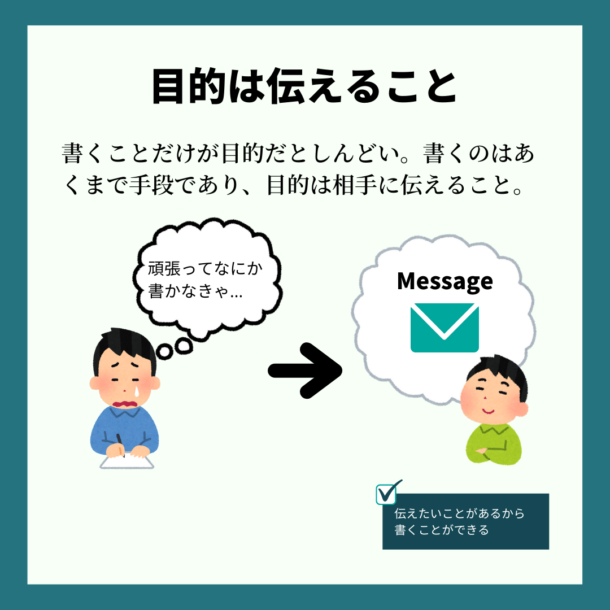
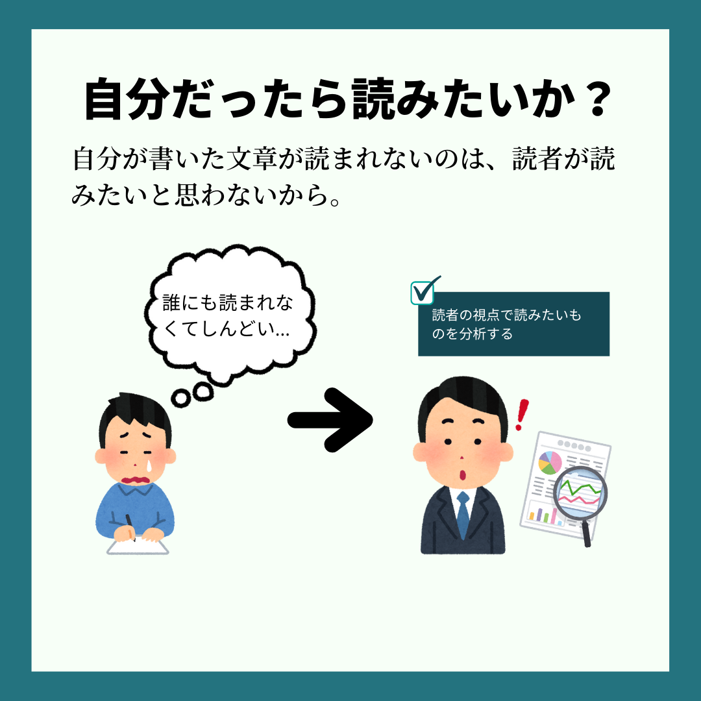

こんにちは、こぷらです。  
今回は note で累計 150 万 PV を獲得したプロ編集者[竹村俊助](https://note.com/take/)さんが書かれた "書くのがしんどい" を紹介します。

<iframe style="width:120px;height:240px;" marginwidth="0" marginheight="0" scrolling="no" frameborder="0" src="//rcm-fe.amazon-adsystem.com/e/cm?lt1=_blank&bc1=000000&IS2=1&bg1=FFFFFF&fc1=000000&lc1=0000FF&t=coppla0b-22&language=ja_JP&o=9&p=8&l=as4&m=amazon&f=ifr&ref=as_ss_li_til&asins=B08CKXKBFM&linkId=10d4ae44f6a571de3485e9fabddc12b9"></iframe>

突然ですが、文章を書くのは難しいと思ったことはあるでしょうか?
私もこのブログを始めてから、書くことについて悩むことが増えました。
著者は編集者としての経験から、ライティング作業を行う人は以下の 5 つが原因で書くことがしんどいと思ってしまうことを発見しました。

- 書くことがなくてしんどい
- 伝わらなくてしんどい
- 読まれなくてしんどい
- つまらなくてしんどい
- 続かなくてしんどい

今回紹介する "[書くのがしんどい](https://amzn.to/311wcwv)" は、そんな悩みに真っ向から向き合ってくれる書籍です。
編集者として数々の本を出版した経験から、書くことがしんどいと思ったときの対策をわかりやすく解説しています。

今回はこの本の中で特にためになった要素を 3 つ紹介します。
もしこの記事の内容に少しでも興味が湧いたら、ぜひ本書を手にとって見てください。

それでは早速始めましょう。

## 目次

```toc
```

## 目的は書くことではなく伝えること

> 大切なのは、「書こう」とすることではなく「伝えよう」とすることです。
> <cite>竹村 俊助. 書くのがしんどい (Japanese Edition) (Kindle の位置No.54). Kindle 版. </cite>

書物を始めると、どうしても書くことが目的化してしまいます。
例えばブログを始めるとします。
様々なブログ指南書や解説記事などを見ると、以下のような目標を立てていたりしないでしょうか?

- 週に3記事以上投稿する
- 毎日1000文字以上書く
- 毎週決まった曜日に投稿する

習慣化するという意味では確かに良いかもしれません。
しかし、がむしゃらに書くだけでは良い文章は生まれませんし、だんだんと書くことがしんどくなるでしょう。
なぜなら、**文章を書くことはあくまで手段であり、本当の目的は相手に何かを伝えること**だからです。



書くことがないのは、あなたが何を伝えたいか考えていないからです。  
文章がわかりにくくつまらないのは、あなたが伝えたいことを明確にできていないからです。  
書くことが続かないのは、書くという作業が目的となってしまっているからです。  

この本の中で私が最も印象に残ったのはこの考え方でした。
なにかメッセージが先にあって、それを伝えるために書くという作業が必要なはずです。
伝えたいことがなく義務感だけで書く作業をしていれば、それは辛くて当然です。

書くことに精一杯で、この目的を忘れがちな人もいるのではないでしょうか?
書き始める前に一度立ち止まって、この文章は誰に何を伝えるために書くのか、それを毎回考えましょう。

ちなみに今回の記事は、「**私と同じく書くことが苦手な人**」へ「**本から学んだ良い文章を書く考え方**」を伝えようと思って書いてます。

## 書くのではなく編集する

> まず下手でもいいから、何も気にせずダーッと伝えたいことを書きなぐる。そして、そのあと冷静になって「編集者」の立場で文章を見直して、整えていく。
> <cite>竹村 俊助. 書くのがしんどい (Japanese Edition) (Kindle の位置No.64-66). Kindle 版.</cite>

何事も 0 から生み出すのはしんどい作業です。
文章も同じで、最初の 1 行を書くのはとてもしんどいです。
最初の一歩がうまく行かずに結局挫折してしまうのはよくある話だと思います。

そこで著者は、**自分の中に「無邪気な書き手」と「イジワルな編集者」の視点をもつ**ことを提案しています。
まずは無邪気な書き手になり、思いついたことをただひたすら書きまくってください。
そして出来上がった原稿を改めて読み直し、編集者目線でひたすらにこき下ろします。
文章を客観視して編集することで読者目線に立った良い文章が書ける、という考えです。


ここで大事なのは、**書きはじめたら必ず最後まで書ききる**ことです。
最初はわかりにくい文章しか書けないかもしれません。
しかし完成した文章があれば、そこからいくらでも修正できます。
さらに多くの人は作るよりも修正することのほうが得意です。
繰り返し修正を重ねれば、必ず良い文章に生まれ変わるでしょう。

この方法は私自身もよくやるので印象に残りました。
この方法の良い点は、だめな文章を書くことを許している点です。
だめな文章でも良いということは、書くことへの心理的なハードルがぐっと下がります。
また、いい文章を書こうとしていつまでも書き終わらない、というあるあるな悩みも解決してくれます。

## 読者に読む動機を与える

> 読まれない文章には「あるもの」がありません。それは「読む動機」です。
> <cite>竹村 俊助. 書くのがしんどい (Japanese Edition) (Kindle の位置No.1288-1289). Kindle 版. </cite>

伝えたいことも見つかった、文章もなんとか書けた、それでも誰にも読んでもらえない。
とてもつらい、心が折れそうになります。
こんなにいいものを作っているのに世間は見る目がない、と愚痴りたくもなるでしょう。
しかし、そこで一歩下がって読者の視点に立って考えてみましょう。

見ず知らずの読者が、わざわざあなたの書いたものを読む意味は何でしょうか?
世間の人は正直です。
役に立ちそうだと思えば読みますし、そうでなければ見向きもしません。
だからこそ常に客観的な視点を持って、**「自分だったらこれを読みたいと思うだろうか?」と考える**ことが重要です。



この考え方にはハッとしました。
ブログを書いているときに、「頑張って書いたから誰か読んでくれ」という気持ちがどこかにありました。
作ったものを押し付けるのではなく、相手が喜ぶ物を提供するというビジネスの基本を忘れてはいけないですね。

本書の中では具体的な対策の一つとして、「この文章を読むことで得られるメリットを示す」方法を提案しています。
例えば、本屋で「人生が変わる〇〇」「夢をかなえる〇〇」というタイトルの本を見たことはないでしょうか?
この人生が変わる・夢をかなえるという部分が、まさしく本を読んで得られるメリットになります。
とてもかんたんにできる対策だと思うので、ガンガン使っていこうと思います。

## まとめ

今回は "書くのがしんどい" という書籍を紹介しました。
当然これを読んだからといってすぐに書くのが楽しくなるわけではないと思います。
ですが、この本を読むことで少しは書くことに対するハードルが下がった気がしました。

ここで紹介した内容は、本全体のごく一部です。
これ以外にもためになる考え方や具体例がたくさん掲載されています。
仕事や趣味でその効果を存分に生かせると思いますので、ぜひ一度読んでみてください。

それでは。

<iframe style="width:120px;height:240px;" marginwidth="0" marginheight="0" scrolling="no" frameborder="0" src="//rcm-fe.amazon-adsystem.com/e/cm?lt1=_blank&bc1=000000&IS2=1&bg1=FFFFFF&fc1=000000&lc1=0000FF&t=coppla0b-22&language=ja_JP&o=9&p=8&l=as4&m=amazon&f=ifr&ref=as_ss_li_til&asins=B08CKXKBFM&linkId=10d4ae44f6a571de3485e9fabddc12b9"></iframe>
