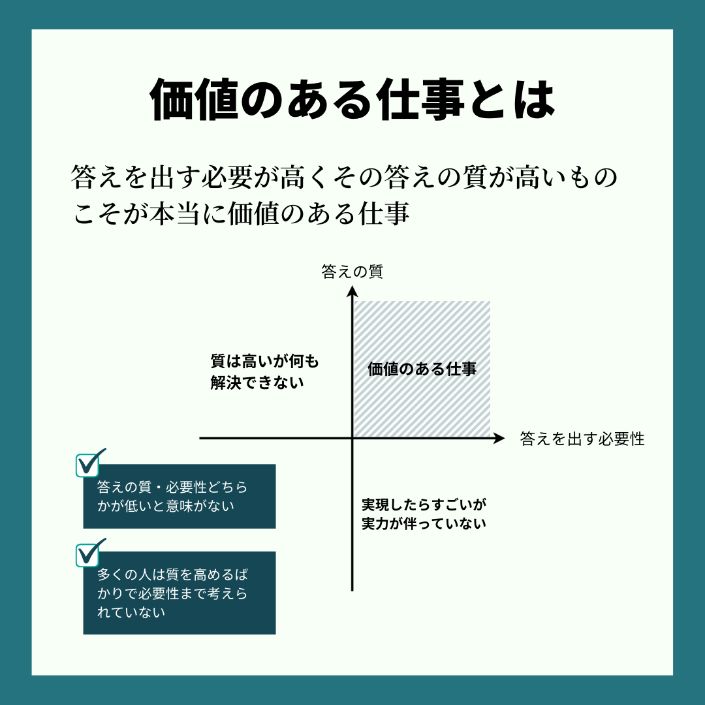
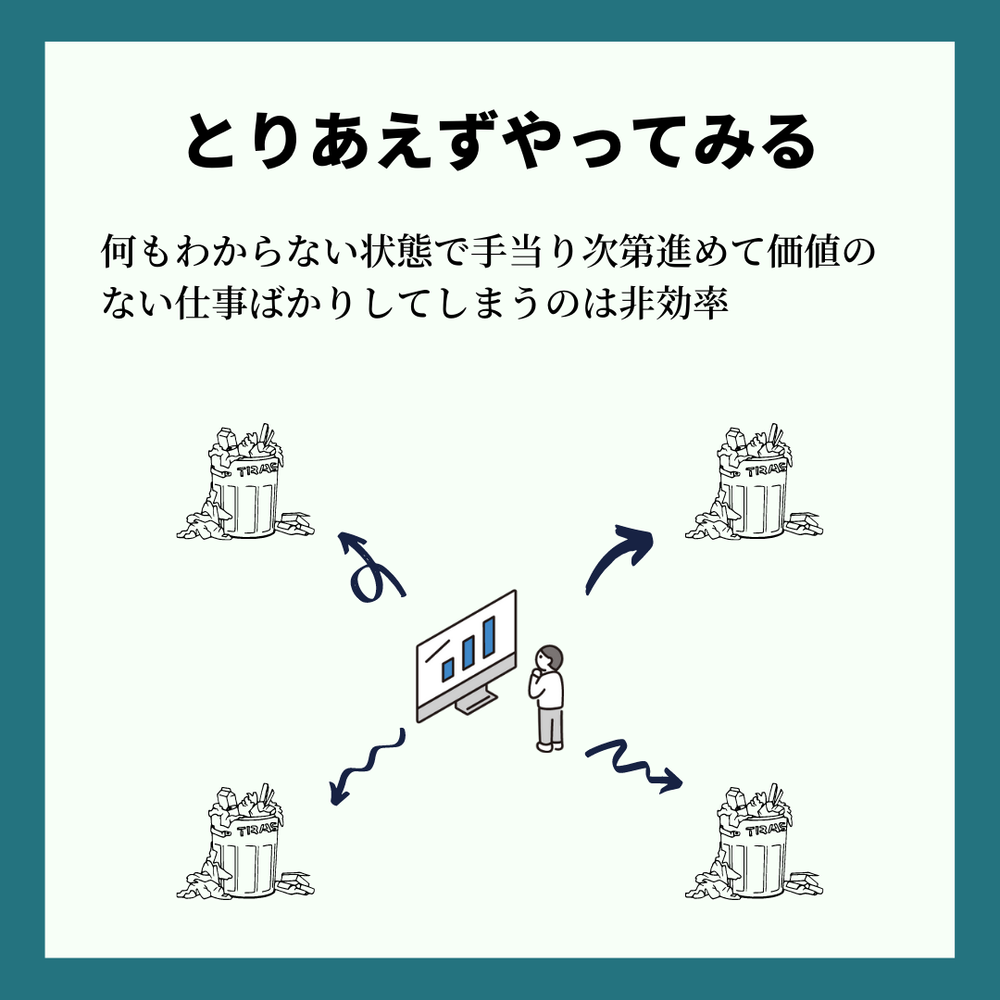
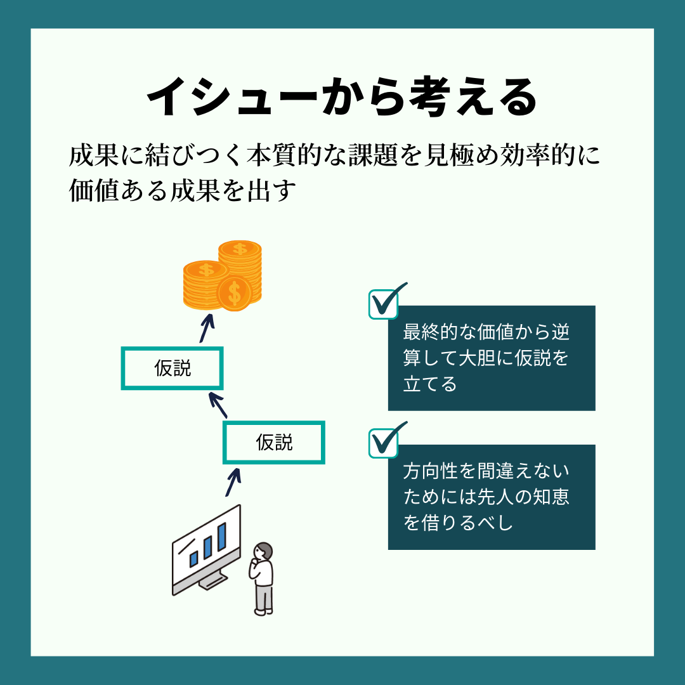

こぷらです。
今回は慶應義塾大学教授であり、ヤフーの CSO を務める安宅和人氏の著書 "イシューからはじめよ - 知的生産の「シンプルな本質」" を紹介します。

<iframe style="width:120px;height:240px;" marginwidth="0" marginheight="0" scrolling="no" frameborder="0" src="//rcm-fe.amazon-adsystem.com/e/cm?lt1=_blank&bc1=000000&IS2=1&bg1=FFFFFF&fc1=000000&lc1=0000FF&t=coppla0b-22&language=ja_JP&o=9&p=8&l=as4&m=amazon&f=ifr&ref=as_ss_li_til&asins=B00MTL340G&linkId=cf30c28403188f28dc045a1682f98379"></iframe>

突然ですが、みなさんは目の前の課題をただがむしゃらに取り組んでしまうことはないでしょうか？
上司・顧客・先輩に言われたことを一生懸命やってみたが、「なんか違うんだよなぁ」と言われたことはないでしょうか？
もしそんな経験があるとしたら、取り組むべき課題を間違えていたかもしれません。
なぜなら、**多くの課題は解決したとしてもほとんど価値がない**からです。

どれだけ一生懸命やっても、取り組む課題自体が間違っていれば相手は満足してくれません。
この本では取り組むべき課題 "**イシュー**" の質を上げることで、少ないコストで価値の高い成果を出す方法を説明しています。
その中から、私が特に気に入った内容を紹介したいと思います。

## 目次

```toc
```

## 価値のある仕事だけに取り組む

どうせ働くなら効率よく働きたいものです。
効率良く働くとはつまり、少ないコストで大きな成果を上げることです。
しかし実際に仕事をしていると、多くのコストを掛けたにもかかわらず有意義な結果が得られないことは多々あります。
これは働く人の頑張り・スキルが足りないのではなく、そもそも価値のある仕事を見極められていないことが原因です。

あなたがたくさん残業し一所懸命に取り組んだとしても、その仕事に価値がなければその仕事は無駄になります。
逆に短い時間しか働いていなくても、その仕事に価値があれば多くの利益や信頼が得られます。
そもそも価値のある仕事とは一体何でしょうか？

## 必要性と成果の質が仕事の価値を決める

著者は価値のある仕事を、「答えを出さねばならない問題に対して高い質の答えを出すこと」と定義しています。



どうでもいい問題に対してどれだけ努力しても、それは価値を生み出しません。
目の前の仕事にがむしゃらに取り組む人は、仕事の質だけにこだわって高品質だが無駄なものを作りがちです。
時間をかけて努力すればするほど本当に価値のある仕事にかける時間がなくなり、満足できる成果を出せなくなります。



逆に生産性の高い人ほど、目の前の仕事の中から本当に価値のあるものだけを見極め、その仕事だけに全力を注ぎ込みます。
予め無駄なことを削ぎ落とすため、少ないコストで大きな成果を得る効率的な働き方ができるのです。

つまり価値のある仕事をするためには、まずやるべきことを見極めることが重要になります。
とりあえずやってみろ、限界まで努力しろという考え方ではいつまで立っても価値ある仕事ができないのです。
それでは、価値のある仕事とはどうやって見極めればよいのでしょうか？

## 何に答えを出す必要があるのかから考える

なにか大きな問題があるとき、やらなければならない仕事がたくさん見えるはずです。
それらを手当り次第取り組んでも、コストがかかるだけで良い結果は得られないでしょう。
問題に取り組むときは、まず「何に答えを出す必要があるのか」から考える必要があります。
これはつまり、最終的に何がわかればこの問題が解決したことになるのか、という結論を考えることです。



最初に結論を考えると聞くと「最初からわかるわけがない」、「やってみなければわからない」と考えるかも知れません。
それでも一歩踏み込んで、具体的な仮説を立てることが大切です。
この仮説が明確になっていないと仕事の途中で迷いや混乱を生み、結果的に無駄な作業が増えてしまいます。
仮に仮説が間違っていたとしても、その方向性さえ正しければ大きな前進になるはずです。

初めて仮説を立てようとしてもきっとうまくできないはずです。
そんなときは周囲の先輩や上司など、頼れる人に方向性の確認をしましょう。
そのときに得れれるフィードバックが、あなたのスキルを更に高めることになるでしょう。

## 知りすぎるとバカになる

最後に、これは自分への戒めでもありますが、情報収集に全力を注いではいけません。
質の高い仮説をたてるためには、情報収集が必須です。
しかし情報を集めすぎてしまうと、今度は逆に新しいアイデアが浮かばなくなってしまいます。
著者は情報を集めすぎることはむしろマイナスに働く可能性があることも警告しています。

例えばこんな経験はないでしょうか？
新しいことを始めたばかりの頃は、様々な疑問やアイデアが浮かぶものです。
しかしある程度習熟してくると、それまでに身に着けた手癖や習慣でこなしてしまい、新しいアイデアを試さなくなってしまう。
私もプログラミングをやっているときに、慣れ親しんだかんたんな書き方をついつい使いまわしてしまいます。

これと同じで、情報収集をやりすぎるとその情報に支配され、自分なりの考えが生み出しづらくなってしまいます。
情報収集すればするほど、既存の情報に縛られて価値ある仕事を生み出せなくなってしまいます。
不安になってつい情報収集に力を入れがちなので、これは肝に銘じでおきたいです。

## まとめ

今回は、生産性を高めて本当に価値のある成果を出す方法をまとめた書籍 "イシューからはじめよ - 知的生産の「シンプルな本質」" を紹介しました。

<iframe style="width:120px;height:240px;" marginwidth="0" marginheight="0" scrolling="no" frameborder="0" src="//rcm-fe.amazon-adsystem.com/e/cm?lt1=_blank&bc1=000000&IS2=1&bg1=FFFFFF&fc1=000000&lc1=0000FF&t=coppla0b-22&language=ja_JP&o=9&p=8&l=as4&m=amazon&f=ifr&ref=as_ss_li_til&asins=B00MTL340G&linkId=cf30c28403188f28dc045a1682f98379"></iframe>

本の最後に書かれていますが、どれだけ本を読んだとしても実際に試してみなければ腹落ちすることはありません。
これからは仕事を始める前に一度立ち止まって、本当にやるべきことはなにかじっくり考えてみることにします。

それでは。
