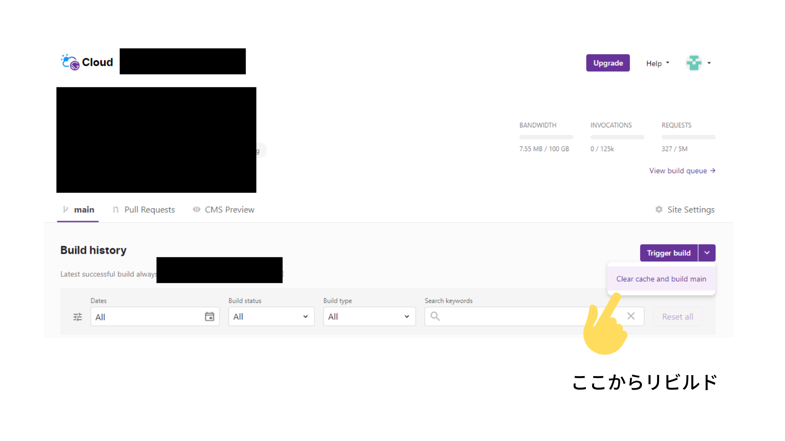

こぷらです。

今回は、React 製のフレームワーク Gatsby に関するお話です。

Gatsby では基本的な設定を Root ディレクトリ直下の `gatsby-config.js` で制御することができます。

従来は、common js しかサポートしておらず、TypeScript 化して運用するには遠回りな方法を取らざるを得ない状況でした。

[Gatsby.jsのTypeScript化 2020 (zenn.dev)](https://zenn.dev/ryo_kawamata/articles/gatsby-ts-2020)

[Gatsby で config ファイルを TypeScript化する | miyauci.me (miyauchi.dev)](https://miyauchi.dev/ja/posts/gatsby-typescript/)

余分な学習コストもかかるため面倒だなと思っていましたが、先日ドキュメントを見ていたところ、最新版(v4.9以降)では TypeScript に対応していることがわかりました。

[https://www.gatsbyjs.com/docs/how-to/custom-configuration/typescript/#gatsby-configts](https://www.gatsbyjs.com/docs/how-to/custom-configuration/typescript/#gatsby-configts)

今回は、実際に TypeScript でビルドが通ることを手を動かして確認したいと思います。

## gatsby-config.js のおさらい

念のため、設定ファイルについておさらいします。

Gatsby のプロジェクトには合計4つの設定ファイルを使うことができます。

gatsby@4.9 以降のバージョンでは、これらすべてのファイルが TypeScript に対応しています。

- gatsby-config.js
- gatsby-node.js
- gatsby-browser.js
- gatsby-ssr.js

各ファイルからは Gatsby の API を呼び出しつつ、設定のカスタマイズが可能です。

TypeScript に慣れきっていると、API の引数・返り値が正しいのかいちいち不安になってしまうことが多くありました。

先述の通り、公式に TypeScript 対応が行われたため、これからは安心して使えるようになりました。

## TypeScript に変換する

それでは早速念願の TypeScript 化してしまいましょう。

といってもやることは非常に簡単で、拡張子を `*.js` から `*.ts` に変えて、中身を Common JS 形式から ES Modules に対応するだけです。

以下は変換前の `gatsby-config.js` です

```jsx
// gatsby-config.js
module.exports = {
  siteMetadata: {
    title: `Gatsby`,
  },
  plugins: [
    `gatsby-transform-plugin`,
    {
      resolve: `gatsby-plugin-name`,
      options: {
        optionA: true,
        optionB: `Another option`,
      },
    },
  ],
}
```

そして変換後はこうなります。

```tsx
// gatsby-config.ts
import type { GatsbyConfig } from "gatsby"

const config: GatsbyConfig = {
  siteMetadata: {
    title: `Gatsby`,
  },
  plugins: [
    `gatsby-transform-plugin`,
    {
      resolve: `gatsby-plugin-name`,
      options: {
        optionA: true,
        optionB: `Another option`,
      },
    },
  ],
}

export default config
```

内容の変化は殆どありませんが、型定義 `GatsbyConfig` を利用していることがわかると思います。

各設定ファイルごとに型定義がしっかりと用意されているため、快適に使うことができます。

## Gatsby Starter Blog を TypeScript 化する

実際にプロジェクトへ適用する例として、今回は定番テンプレートの [gatsby-starter-blog: Gatsby Starter | Gatsby (gatsbyjs.com)](https://www.gatsbyjs.com/starters/gatsbyjs/gatsby-starter-blog) を TypeScript 化してみます。

まずはプロジェクトを作成します。

```bash
npx gatsby new gatsby-starter-blog https://github.com/gatsbyjs/gatsby-starter-blog
```

完了したら、TypeScript をインストールします。

```bash
yarn add typescript
```

設定ファイルを編集します。

```tsx:title=gatsby-config.ts
import type { GatsbyConfig } from "gatsby"

const config: GatsbyConfig = {
  // 変更ないため省略
}

export default config
```

```tsx:title=gatsby-node.ts
import path from "path"
import { createFilePath } from "gatsby-source-filesystem"
import type { GatsbyNode } from "gatsby"

export const createPages: GatsbyNode["createPages"] = async ({
  graphql,
  actions,
  reporter,
}) => {
  const { createPage } = actions

  // Define a template for blog post
  const blogPost = path.resolve(`./src/templates/blog-post.js`)

  // Get all markdown blog posts sorted by date
  type AllMarkdownNode = {
    allMarkdownRemark: {
      nodes: Array<{
        id: string
        fields: {
          slug: string
        }
      }>
    }
  }
  const result = await graphql<AllMarkdownNode>(
    `
      {
        allMarkdownRemark(
          sort: { fields: [frontmatter___date], order: ASC }
          limit: 1000
        ) {
          nodes {
            id
            fields {
              slug
            }
          }
        }
      }
    `
  )
  // 変更ないため省略
}

export const onCreateNode: GatsbyNode["onCreateNode"] = ({
  node,
  actions,
  getNode,
}) => {
  // 変更ないため省略
}

export const createSchemaCustomization: GatsbyNode["createSchemaCustomization"] =
  ({ actions }) => {
  // 変更ないため省略
  }

```

ポイントは、各カスタム動作に提供されている型を当てることです。

ただそれだけだと、`gatsby-node.ts` 内の graphql を使用している場所で型情報がないためエラーを出すかと思います。

そこで今回は、かんたんに型を定義してエラーを回避してみました。

設定ファイルを書き換えたらビルドしてみます。

以前まではできませんでしたが、ビルドに成功していることが確認できるはずです。

```bash
yarn build
```

## Gatsby Cloud 上でビルドに失敗する

実際に TypeScript 化して運用してからハマった点を紹介します。

TypeScript 化した上で Gatsby Cloud 上にデプロイしているプロジェクトで、たまにビルドが失敗することがあります。

エラーログは以下の通りで、意訳すると `gatsby-config.ts` じゃなくて、 `gatsby-config.js` を使ってね、と書かれています。

```bash
Node version v14.19.3
Gatsby version Gatsby CLI version: 4.12.1
Gatsby version: 4.12.1
  Note: this is the Gatsby version for the site at: /usr/src/app/www
INCREMENTAL_PREVIEWS
Setting gatsby to /usr/src/app/www/node_modules/gatsby
info Running Inc Build CLI v3.0.0-inc-deploy.22
 Tracing initialized
success compile gatsby files - 8.811s
ERROR It looks like you were trying to add the config file? Please rename "gatsby-config.ts" to "gatsby-config.js"
```

間違えて古いバージョンを使ってしまったかとも思ったのですが、ログにv4.12とばっちり書かれているため問題ないはずです。

調べてみたら、GitHub 上に同様の Issue がいくつか立っており、どれも原因の特定には至ってないようです。

[https://github.com/gatsbyjs/gatsby/issues/35768](https://github.com/gatsbyjs/gatsby/issues/35768)

古いビルドを clean してからやり直せば動くよ、とのことだったので、私も現状はエラーが起きたら手動でリビルドするようにしています。

Gatsby Cloud 上で古いキャッシュを削除するには、ダッシュボードにある "Trigger Build” ボタンから "Clean cache and build ***” ボタンを押すことで実行できます。



## まとめ

今回は、Gatsby の設定ファイルを TypeScript 化する方法を紹介しました。

誰でも簡単に TypeScript 化することができるようになり、より快適に開発を行うことができるようになります。

今後も、ひたすら楽してプログラミングをするための様々な Tips を紹介していきたいと思います。

もしためになったと感じたら、SNS でシェアしていただけると幸いです。

それでは。
