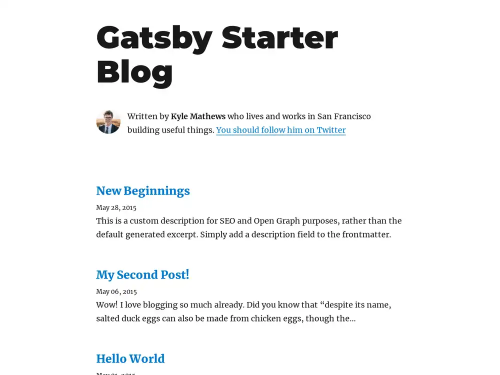
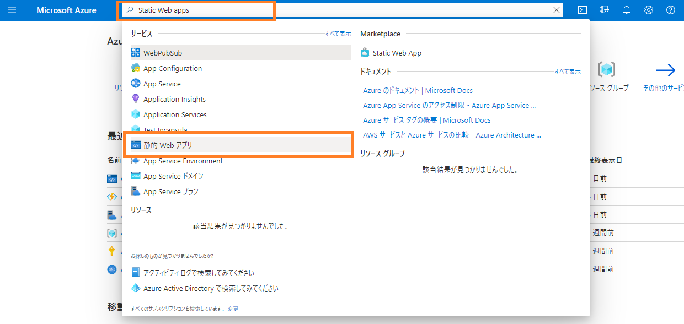
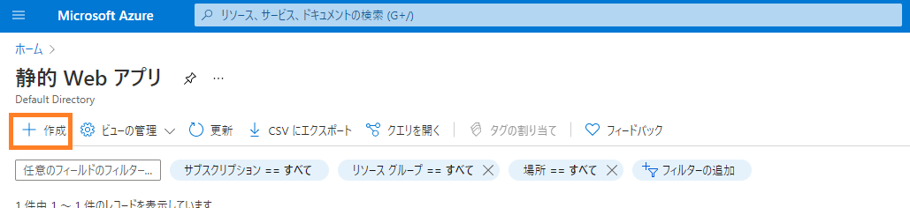
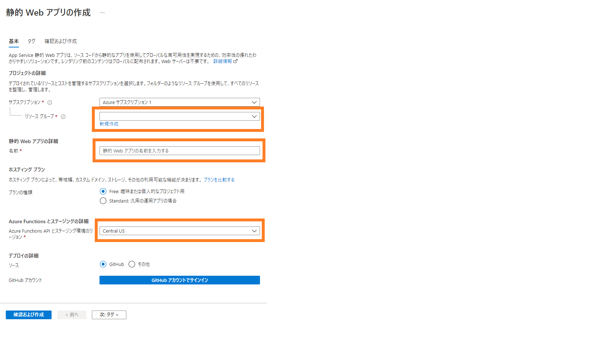
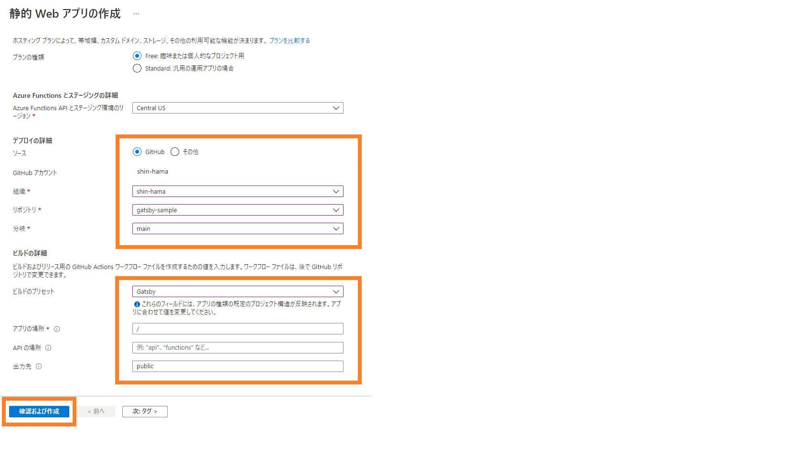
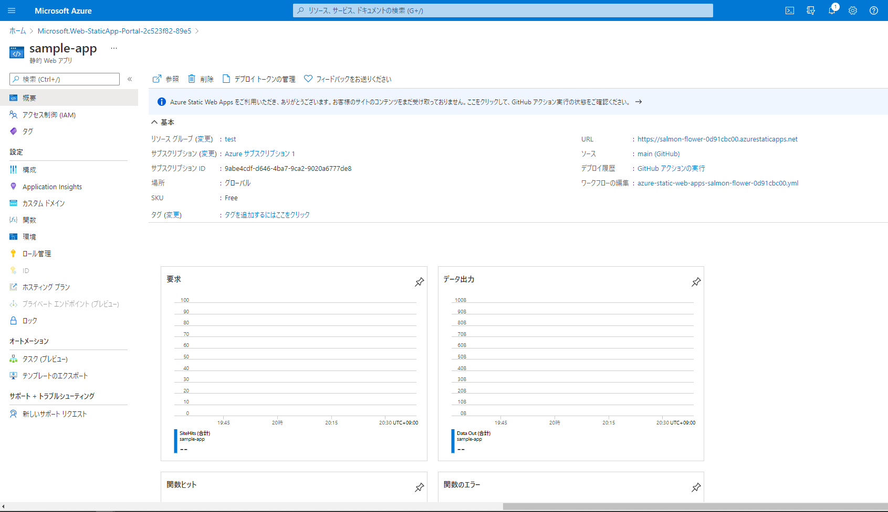

こぷらです。
今回は本ブログを開設するために使った方法を紹介したいと思います。

本ブログは SSG である [Gatsby](https://www.gatsbyjs.com/) を使って作成し、[Azure Static Web Apps](https://azure.microsoft.com/ja-jp/services/app-service/static/) 上にホスティングされています。
この記事では、Gatsby でプロジェクトを作成するところから、Azure Static Web Apps でネットに公開するまでのプロセスを紹介します。

## Gatsby とは

Gatsby は `JavaScript` の UI 構築ライブラリ React をベースにした静的サイト生成用のフレームワークです。
公式サイトでは、Gatsby の特徴を以下のように謳っています。

> Gatsby enables developers to build fast, secure, and powerful websites using a React-based framework and innovative data layer that makes integrating different content, APIs, and services into one web experience incredibly simple.

意訳すれば、「高速で安全で美しい Web サイトがかんたんに作れます。」ということです。
実際に使って見て以下のような点が優れていると感じました。

- 豊富なテンプレートとプラグインがあり始めやすい
- 細かい設定の編集方法がわかりやすい
- React ベースのためページの編集が用意
- 既存のブログサービスよりも自分好みにカスタマイズしやすい

それでは早速 Gatsby を使ったサンプルアプリを作ってみましょう。

## プロジェクト作成

事前準備として、Node.js と Git をインストールします。
方法は割愛しますが、公式サイトに従えばすぐできます。

- Node.js: <https://nodejs.org/>
- Git: <https://git-scm.com/>

インストールが完了したら、コマンドプロンプトを開き以下のコマンドを実行します。

```Shell
npx gatsby new {project_name} {starter}
```

`{project_name}` は任意のプロジェクト名を、`{starter}` にはテンプレートを指定します。
公式のテンプレート集は[こちら](https://www.gatsbyjs.com/starters/)にありますが、今回は本ブログで使用している [gatsby-starter-blog](https://www.gatsbyjs.com/starters/gatsbyjs/gatsby-starter-blog/) を使用します。

```Shell
npx gatsby new sample-project https://github.com/gatsbyjs/gatsby-starter-blog
```

プロジェクトが作成されたら、作成されたプロジェクトのディレクトリに移動して、開発サーバーを起動します。
サーバーを起動すると Web アプリのビルドが始まり、開発サーバー経由でアプリを開くことができます。

```Shell
cd sample-project
npm run start
…
You can now view gatsby-starter-blog in the browser.
⠀
  http://localhost:8000/

…
```

無事ビルドが通ったら、表示されているアドレス(デフォルトなら <http://localhost:8000>) にアクセスしてみましょう。
以下画像のようなページが表示されるはずです。



とりあえず、これでアプリとして動かせるようになりました。
色々いじってみたいところですが、それはまたの機会にして次は Azure Static Web Apps を使ってネット上に公開してみましょう。

## Azure Static Web Apps とは

[公式ドキュメント](https://docs.microsoft.com/ja-jp/legal/termsofuse) の一文が端的かつわかりやすかったのでそのまま引用させてもらいます。

> Azure Static Web Apps は、コード リポジトリから Azure にフル スタックの Web アプリを自動的にビルドしてデプロイするサービスです。

一緒に掲載されていた画像も非常にわかりやすかったので、ぜひ見てみてください。
ドキュメントにある通り、GitHub などのレポジトリから自動でデプロイまで行ってくれる非常に便利なサービスです。

それでは、実際にやってみましょう。

## ホスティング

まずは、GitHub 上にリポジトリを作成します。
手順は割愛しますが、Private リポジトリでも問題なく動きますので、好きに作って大丈夫だと思います。
リポジトリを作成したら、先ほどまでに作った新規プロジェクトを Push しておきましょう。
Gatsby プロジェクトはすでに Git リポジトリ化されているので、remote を追加して Push します。

```Shell
git remote add origin https://github.com/your-name/your-app.git
git push -u origin HEAD
```

次に、Azure 上で Static Web Apps を作成します。
Microsoft アカウントの作成はすでに終わっている前提で解説します。

1. ホーム画面上部にて 「Static Web Apps」 、もしくは「静的 Web アプリ」を検索
  

2. 「作成」ボタンで新規アプリを作成
  

3. 指示に従って、設定を入力 (すべて任意の値でOK) し、GitHub アカウントでサインインする
  

4. アカウント情報から作成したレポジトリとデフォルトブランチを選びます。
5. 「ビルドのプリセット」にて `Gatsby` を選択し、残りはデフォルトのまま「確認および作成」をクリック
  

6. 確認画面が出ますので、問題なければ「作成」をクリック
7. デプロイが完了したら、リソースへ移動します。

リソースに移動すると以下のような画面になります。


作業はこれで終了ですが、URL 項目の下にある GitHub アクションの実行というボタンをクリックしてください。
GitHub へ飛び、GitHub Actions の実行状況が表示されます。
今後は、設定したデフォルトブランチに Push をするたび、この Actions が実行され、問題なければ Azure 上にデプロイされることになります。

Actions の項目にチェックマークがついたらリソースページに戻り URL 項目をクリックしてください。
ローカルの開発サーバーでアクセスしたものと同じページが確認できると思います。
以上で、ネット上への公開作業は終了です。

今回使ったソースコードはこちらです。
Starter から何も変えてませんが参考までに。

GitHub: <https://github.com/shin-hama/gatsby-sample>

## まとめ

いかがだったでしょうか。
見てもらった通り、実作業はほとんどなく決まったコマンドと僅かな設定だけでかんたんにブログを作ることができました。

Gatsby に限らず、さまざまな方法でアプリを作ることができますので、みなさんもぜひためしてみてください。

それでは。
