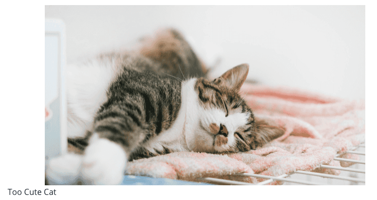
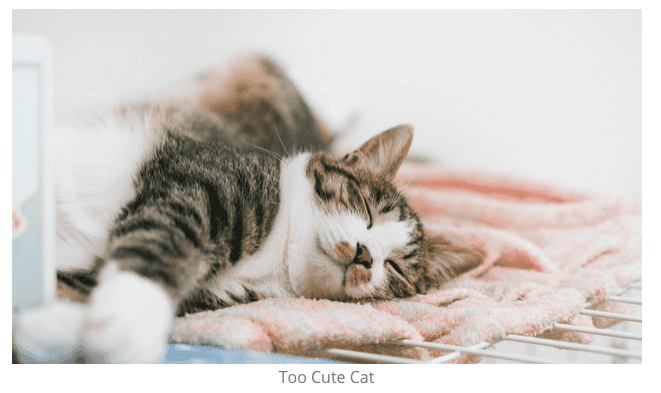

こぷらです。
Gatsby でブログを作成中に、画像へキャプションをつけたくなりました。
やり方が無いか調べてみたら、以下プラグインのドキュメントに期待通りのオプションが説明されていました。

<div class="iframely-embed"><div class="iframely-responsive" style="height: 140px; padding-bottom: 0;"><a href="https://www.gatsbyjs.com/plugins/gatsby-remark-images/" data-iframely-url="//cdn.iframe.ly/PrBJcQn?card=small"></a></div></div><script async src="//cdn.iframe.ly/embed.js" charset="utf-8"></script>

そこで今回は、Gatsby で作ったサイト上で画像にキャプションを設定する方法について紹介したいと思います。
それでは早速始めましょう。

## TL; DR;

`gatsby-remark-images` プラグインのオプションで `showCaptions: true` に設定する。

```JavaScript:title=gatsby-config.json
{
  resolve: `gatsby-remark-images`,
  options: {
    showCaptions: true, // Option for caption
  },
},
```

`title` 属性か、それがなければ `alt` 属性の要素がキャプションとして表示されます。

## 設定方法

`gatsby-remark-images` プラグインのオプションで設定が可能です
なお、このプラグインを使うためには、別途 `gatsby-plugin-sharp` と `gatsby-transformer-remark` プラグインが必要なため、合わせてインストールしてください。

```shell
npm install gatsby-remark-images gatsby-plugin-sharp
```

```javascript:title=gatsby-config.js
plugins: [
  `gatsby-plugin-sharp`,
  {
    resolve: `gatsby-transformer-remark`,
    options: {
      plugins: [
        {
          resolve: `gatsby-remark-images`,
          options: {
            showCaptions: true, // Option for caption
          },
        },
      ],
    },
  },
]
```

どの要素がタイトルになるかは、ドキュメントの説明文でこう書かれています。

> Add a caption to each image with the contents of the title attribute, when this is not empty. If the title attribute is empty but the alt attribute is not, it will be used instead.
> <cite>gatsby-remark-images | <https://www.gatsbyjs.com/plugins/gatsby-remark-images/?=images></cite>

つまり、`title` 属性が指定されていればその値を、なければ `alt` 属性の値を使用します。
ちなみに Markdown ファイル内で画像を挿入する際の `alt`, `title` 属性は以下のように指定可能

```Markdown

```

### スタイリング

デフォルトでは画像の下中央に来てないので、css を編集します。
ついでに、文字色も目立たないようにしています。

```css
figcaption {
  text-align: center;
  color: gray;
}
```

ほんの少しの変化ですが、スタイルの適用前後でみやすさが段違いです。





## 表示項目の優先度を変更したい

デフォルトでは `title` 属性を優先しますが、`alt` 属性を優先したり `title` を指定しなかったら何も表示したくないときもあると思います。
その場合は、オプション指定時に `true` の代わりに、配列で優先順位を与えることもできます。
以下例では、caption の値に `title` 属性だけを反映するようにしています

```javascript:title=gatsby-config.js
{
  resolve: `gatsby-remark-images`,
  options: {
    showCaptions: ["title"],
  },
},
```

## キャプションを `<p>` 要素で扱いたい

追加のオプションとして、キャプションの要素を変更できます。
具体的には `markdownCaptions` オプションを指定すると、`<figcaption><p>title</p></figcaption>` となります。

```javascript:title=gatsby-config.js
{
  resolve: `gatsby-remark-images`,
   options: {
    showCaptions: true,
    markdownCaptions: true,
  },
},
```

```html
<!-- markdownCaptions: false (default)-->
<figure>
    
    <figcaption>title</figcaption>
</figure>

<!-- markdownCaptions: true (default)-->
<figure>
    
    <figcaption>
        <p>title</p>
    </figcaption>
</figure>
```

どちらがいいかはお好みだと思いますが、参考までに。

## まとめ

今回は Gatsby のプラグインを使って、画像にキャプションを付ける方法を紹介しました。
かんたんに設定できたので、皆さんも是非やってみてください。

それでは。
