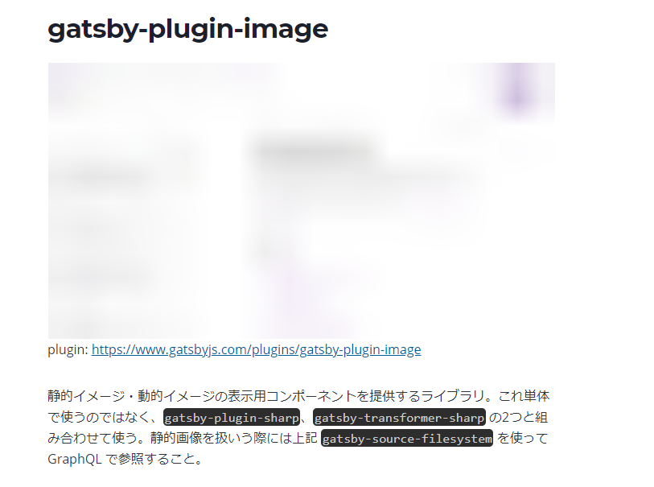

<!-- markdownlint-configure-file { "MD024": false } -->
こぷらです。
今回はこのブログで使われている Gatsby プラグインを紹介します。

Gatsby はプラグインが非常に豊富で、使いたい機能をかんたんに実装できます。
その一方で数が多すぎて各機能を把握しきれないこともあります。
ブラックボックスで運用してしまうのは気持ち悪いので、自分の理解のためにも一度まとめておこうと思います。
便利なプラグインを探している方もぜひ参考にしてください。

## ファイル管理

### gatsby-source-filesystem

plugin: <https://www.gatsbyjs.com/plugins/gatsby-source-filesystem/>

- ソースファイル以外の静的ファイルをビルドに組み込むための設定を行う
- このプラグインで取り込んだ静的ファイルは、GraphQL で参照可能になる

#### インストール方法

```shell
yarn add gatsby-source-filesystem
```

#### config 例

```javascript:title=gatsby-config.js
module.exports = {
  plugins: [
    {
      resolve: `gatsby-source-filesystem`,
      options: {
        name: `pages`,
        path: `${__dirname}/src/pages/`,
      },
    },
  ],
}
```

#### 使い方

読み込んだファイルは以下のクエリで参照可能。config ファイルで指定した `name` は `sourceInstanceName` で参照可能。その他どんなプロパティがあるかは GraphQL Explorer で確認されたし。

```graphql
{
  allFile(filter: { sourceInstanceName: { eq: "pages" } }) {
    edges {
      node {
        extension
        dir
        sourceInstanceName
      }
    }
  }
}

```

### gatsby-plugin-image

plugin: <https://www.gatsbyjs.com/plugins/gatsby-plugin-image>

- 静的イメージ・動的イメージの表示用コンポーネントを提供するライブラリ
- これ単体で使うのではなく、`gatsby-plugin-sharp`、`gatsby-transformer-sharp` の2つと組み合わせて使う
- 静的画像を扱いう際には上記 `gatsby-source-filesystem` を使って GraphQL で参照すること
- 画像サイズの圧縮や最適化などを行う

#### インストール方法

```shell
yarn add gatsby-plugin-image gatsby-plugin-sharp gatsby-transformer-sharp
```

#### config 例

```javascript:title=gatsby-config.js
module.exports = {
  plugins: [
    `gatsby-plugin-image`,
    `gatsby-plugin-sharp`,
    `gatsby-transformer-sharp`, // Needed for dynamic images
  ],
}
```

#### 使い方

詳細はドキュメントに任せるとして、静的・動的イメージコンポーネントの使用例を紹介します。使い分けは、テンプレート内で常に同じものを表示するなら静的、場合によって変わるものは動的にすれば良い。

```javascript:title=StaticImage.jsx
import { StaticImage } from "gatsby-plugin-image"

export function Dino() {
 return (
   <StaticImage
     src="../images/dino.png"
     alt="A dinosaur"
     placeholder="blurred"
     layout="fixed"
     width={200}
     height={200}
   />
 )
}
```

```javascript:title=DynamicImage.jsx
import { graphql } from "gatsby"
import { GatsbyImage, getImage } from "gatsby-plugin-image"

function BlogPost({ data }) {
 const image = getImage(data.blogPost.avatar)
 return (
   <section>
     <h2>{data.blogPost.title}</h2>
     <GatsbyImage image={image} alt={data.blogPost.author} />
     <p>{data.blogPost.body}</p>
   </section>
 )
}

export const pageQuery = graphql`
 query {
   blogPost(id: { eq: $Id }) {
     title
     body
     author
     avatar {
       childImageSharp {
         gatsbyImageData(
           width: 200
           placeholder: BLURRED
           formats: [AUTO, WEBP, AVIF]
         )
       }
     }
   }
 }
`
```

## Markdown サポート

### gatsby-transformer-remark

plugin: <https://www.gatsbyjs.com/plugins/gatsby-transformer-remark>

- Markdown 内の要素を解析して表示を最適化するプラグイン
- このプラグインと組み合わせて動くプラグインが多数存在する。
- おそらく `gatsby-source-filesystem` で指定したファイル群から Markdown を解析しているのだが、明確な記述は見つけられなかった。

#### インストール方法

```shell
yarn add gatsby-transformer-remark
```

#### config 例

```javascript:title=gatsby-config.js
module.exports = {
  plugins: [
  {
    resolve: `gatsby-transformer-remark`,
    options: {
      // Footnotes mode (default: true)
      footnotes: true,
      // GitHub Flavored Markdown mode (default: true)
      gfm: true,
      // Plugins configs
      plugins: [],
    },
  },
  ],
}
```

#### 使い方

以下クエリで Markdown ファイルの要素を指定可能になる。

```GraphQL
{
  allMarkdownRemark {
    edges {
      node {
        html
        headings {
          depth
          value
        }
        frontmatter {
          # Assumes you're using title in your frontmatter.
          title
        }
      }
    }
  }
}
```

`frontmatter` とは Markdown ファイルの冒頭に記載する任意の情報。自分で任意に付け足して、ブログ上に表示することも可能。

```markdown
---
name: 'sample'
date: 'YYYY-MM-DDTHH:mm:ss'
description: ''
---

### Hello World
```

### gatsby-remark-images

plugin: <https://www.gatsbyjs.com/plugins/gatsby-remark-images>

- Markdown 内の画像をビルド時に読み込むためのプラグイン
- 読み込み前はぼやっとした画像を表示して、画像領域を確保してレイアウト崩れを防止

- レスポンシブデザインの対応なども行ってくれる

#### インストール方法

```shell
yarn add gatsby-remark-images gatsby-plugin-sharp
```

#### config 例

```javascript:title=gatsby-config.js
module.exports = {
  plugins: [
    `gatsby-plugin-sharp`,
    {
      resolve: `gatsby-transformer-remark`,
      options: {
        plugins: [
          {
            resolve: `gatsby-remark-images`,
            options: {
              // It's important to specify the maxWidth (in pixels) of
              // the content container as this plugin uses this as the
              // base for generating different widths of each image.
              maxWidth: 590,
            },
          },
        ],
      },
    },
  ],
}
```

#### 使い方

Markdown 記法で画像のパスを記入すれば良い。

```Markdown

```

実際の表示


### gatsby-remark-responsive-iframe

plugin: <https://www.gatsbyjs.com/plugins/gatsby-remark-responsive-iframe>

- Markdown 内の `iframe` やオブジェクトをきれいに表示するためのプラグイン
- もとのアスペクト比を固定して幅を最大化してくれる
- [iframely](https://iframely.com/embed) で作ったカードを表示するために導入

#### インストール方法

```shell
yarn add gatsby-remark-responsive-iframe
```

#### config 例

```javascript:title=gatsby-config.js
module.exports = {
  plugins: [
    {
      resolve: `gatsby-transformer-remark`,
      options: {
        plugins: [`gatsby-remark-responsive-iframe`],
      },
    },
  ]
}
```

#### 使い方

Markdown 内で `<iframe>` タグを使用する

```html
<div class="iframely-embed"><div class="iframely-responsive" style="height: 140px; padding-bottom: 0;"><a href="https://iframely.com/" data-iframely-url="//cdn.iframe.ly/KGpjY3"></a></div></div><script async src="//cdn.iframe.ly/embed.js" charset="utf-8"></script>
```

実際の表示

<div class="iframely-embed"><div class="iframely-responsive" style="height: 140px; padding-bottom: 0;"><a href="https://iframely.com/" data-iframely-url="//cdn.iframe.ly/KGpjY3"></a></div></div><script async src="//cdn.iframe.ly/embed.js" charset="utf-8"></script>

### gatsby-plugin-twitter

plugin: <https://www.gatsbyjs.com/plugins/gatsby-plugin-twitter>

- 上記 `gatsby-remark-responsive-iframe` を Twitter に特化させたもの
- 競合を避けるために、設定ファイル内で `gatsby-remark-responsive-iframe` よりも前に記載する

#### インストール方法

```shell
yarn add gatsby-plugin-twitter
```

#### config 例

```javascript:title=gatsby-config.js
module.exports = {
  plugins: [
    `gatsby-plugin-twitter`
  ],
}
```

#### 使い方

1. 表示したいツイートを開く
2. ツイート右上のオプションから "コードを埋め込む" を選択
3. 開かれたページの "Copy Code" ボタンを押して、Markdown 上に貼り付け

### gatsby-remark-embed-video

plugin: <https://www.gatsbyjs.com/plugins/gatsby-remark-embed-video>

- YouTube などの動画を埋め込むプラグイン
- 競合を避けるために、設定ファイル内で `gatsby-remark-responsive-iframe`, `gatsby-remark-prismjs`, `gatsby-remark-images` よりも前に記載する

#### インストール方法

```shell
yarn add gatsby-remark-embed-video
```

#### config 例

```javascript:title=gatsby-config.js
module.exports = {
  plugins: [
    "gatsby-remark-embed-video",
    "gatsby-remark-responsive-iframe",
    "gatsby-remark-prismjs",
    "gatsby-remark-images"
  ],
}
```

#### 使い方

コードブロックを用意して動画サイトの URL を貼り付ければ OK

```markdown
`youtube: https://www.youtube.com/watch?v=6w0im3LHazY`
```

`youtube: https://www.youtube.com/watch?v=6w0im3LHazY`

### gatsby-remark-autolink-headers

plugin: <https://www.gatsbyjs.com/plugins/gatsby-remark-autolink-headers>

- Markdown 内の各 Head に自動でホバーリンクをつけるプラグイン

#### インストール方法

```shell
yarn add gatsby-remark-autolink-headers
```

#### config 例

```javascript:title=gatsby-config.js
module.exports = {
  plugins: [
    `gatsby-remark-autolink-headers`
  ],
}
```

#### 使い方

特になし、ヘッダータグ (`#`) をつければビルド時にリンクが貼られる。
画面上ではヘッダー横にアイコンが表示される。
オプションで変更可能だが、デフォルトのままで十分なので説明は割愛。

gatsby-remark-autolink-headers

### gatsby-remark-table-of-contents

plugin: <https://www.gatsbyjs.com/plugins/gatsby-remark-table-of-contents>

- Markdown 内の Head タグ (`#`) を読み込んで自動で目次を作成するプラグイン
- 上記の `gatsby-remark-autolink-headers` が必須

#### インストール方法

```shell
yarn add gatsby-remark-table-of-contents
```

#### config 例

```javascript:title=gatsby-config.js
module.exports = {
  plugins: [
    {
      resolve: `gatsby-transformer-remark`,
      options: {
        plugins: [
          {
            resolve: `gatsby-remark-table-of-contents`,
            options: {
              exclude: "Table of Contents",
              tight: true,
              ordered: false,
              fromHeading: 2,
              toHeading: 6,
              className: "table-of-contents"
            },
          },
          `gatsby-remark-autolink-headers`
        ],
      },
    },
  ],
}
```

#### 使い方

Markdown ファイル内で以下のコードブロックを追加すると、その部分がビルド時に目次に変換される。

    ```toc
    ```

### gatsby-remark-prismjs

plugin: <https://www.gatsbyjs.com/plugins/gatsby-remark-prismjs>

- Markdown 内のコードブロックを整形するためのプラグイン
- 設定可能な内容が豊富で便利な半面、使いこなすのは難しい

#### インストール方法

```shell
yarn add gatsby-remark-prismjs
```

#### config 例

```javascript:title=gatsby-config.js
module.exports = {
  plugins: [
    {
      resolve: `gatsby-remark-prismjs`,
      options: {
        classPrefix: 'language-',
        inlineCodeMarker: null,
        aliases: {},
        showLineNumbers: true,
        noInlineHighlight: false,
      },
    },
  ],
}
```

#### 使い方

`gatsby-config.js` 以外の設定も必要。

```javascript:title=gatsby-browser.js
import 'prismjs/themes/prism-tomorrow.css'  // コードブロックの見た目を定義するテーマ
import 'prismjs/plugins/line-numbers/prism-line-numbers.css'  // 行数表示用
```

ここで import するテーマを変えることで、見た目を変更することができる。

設定ができたら、通常の Markdown 記法でコードブロックを書けば OK。
レイアウトの設定はかなり細かい話になってしまうので、ドキュメントを参照。

### gatsby-remark-code-titles

plugin: <https://www.gatsbyjs.com/plugins/gatsby-remark-code-titles>

- コードブロックにタイトルを設定するプラグイン
- 競合を避けるために、`gatsby-remark-prismjs` より前に設定する

#### インストール方法

```shell
yarn add gatsby-remark-code-titles
```

#### config 例

```javascript:title=gatsby-config.js
module.exports = {
  plugins: [
    
  ],
}
```

#### 使い方

まず CSS にスタイルを定義する

```css
.gatsby-code-title {
  background: #0d0d0d;
  color: #ccc;
  margin-bottom: -0.65em;
  padding: 0.7rem 1.05rem;
  font-size: 0.8em;
  line-height: 0.2;
  font-family: Consolas, Monaco, 'Andale Mono', 'Ubuntu Mono', monospace;
  font-weight: 500;
  border-radius: 8px 8px 0 0;
  display: table;
}
```

Markdown ファイル内でコードブロックを書く際に以下のようにタイトルも記述する

    ```markdown:title=sample.md
    # HelloWorld
    ```

実際の表示

```markdown:title=sample.md
# HelloWorld
```

### gatsby-remark-copy-linked-files

plugin: <https://www.gatsbyjs.com/plugins/gatsby-remark-copy-linked-files>

- ビルド時に Markdown 内でリンクされている外部ファイルを取り込むプラグイン

#### インストール方法

```shell
yarn add gatsby-remark-copy-linked-files
```

#### config 例

```javascript:title=gatsby-config.js
module.exports = {
  plugins: [
    `gatsby-remark-copy-linked-files`
  ],
}
```

#### 使い方

特になし、Markdown 内のリンクが適当なファイルになっているときに、ビルド時に自動で実行してくれる

### gatsby-remark-smartypants

plugin: <https://www.gatsbyjs.com/plugins/gatsby-remark-smartypants>

- 句読点やクォートなどをきれいなフォントに変換するプラグイン

#### インストール方法

```shell
yarn add gatsby-remark-smartypants
```

#### config 例

```javascript:title=gatsby-config.js
module.exports = {
  plugins: [
    `gatsby-remark-smartypants`
  ],
}
```

#### 使い方

特になし

## SEO サポート

### gatsby-plugin-google-gtag

plugin: <https://www.gatsbyjs.com/plugins/gatsby-plugin-google-gtag>

- Google の提供するグローバルサイトタグを簡単に追加するプラグイン
- Google Analytics などを追加できる

#### インストール方法

```shell
yarn add gatsby-plugin-google-gtag
```

#### config 例

```javascript:title=gatsby-config.js
module.exports = {
  plugins: [
    {
      resolve: `gatsby-plugin-google-gtag`,
      options: {
        trackingIds: [
          "GA-TRACKING_ID", // Google Analytics / GA
        ],
        pluginConfig: {
          // Puts tracking script in the head instead of the body
          head: false,
        },
      },
    },
  ],
}
```

#### 使い方

詳細な説明は割愛するが、Google の各サービスで発行された ID を config ファイルに記載するだけで使用可能。

### gatsby-plugin-feed

plugin: <https://www.gatsbyjs.com/plugins/gatsby-plugin-feed>

- Web サイトの RSS Feed を作成するプラグイン

#### インストール方法

```shell
yarn add gatsby-plugin-feed
```

#### config 例

```javascript:title=gatsby-config.js
module.exports = {
  plugins: [
    { 
      resolve: `gatsby-plugin-feed`,
      options: {
        // many options ...
      }
    }
  ],
}
```

#### 使い方

設定をするだけでよいのだが、その量が非常に多いので割愛。
基本は Starter の初期設定とプラグインのドキュメントに従えば設定可能。

### gatsby-plugin-manifest

plugin: <https://www.gatsbyjs.com/plugins/gatsby-plugin-manifest>

- [PWA](https://developer.mozilla.org/en-US/docs/Web/Progressive_web_apps) に最適化した manifest.json を作成するプラグイン
- 競合を避けるために `gatsby-plugin-offline` よりも前に定義する

#### インストール方法

```shell
yarn add gatsby-plugin-manifest
```

#### config 例

```javascript:title=gatsby-config.js
module.exports = {
  plugins: [
    {
      resolve: `gatsby-plugin-manifest`,
      options: {
        name: `GatsbyJS`,
        short_name: `GatsbyJS`,
        start_url: `/`,
        background_color: `#f7f0eb`,
        theme_color: `#a2466c`,
        display: `standalone`,
      },
    },
  ],
}
```

#### 使い方

ドキュメントに従って適切に設定すれば OK

### gatsby-plugin-offline

plugin: <https://www.gatsbyjs.com/plugins/gatsby-plugin-offline>

- Service Worker を作成して Offline 環境でも Web サイトが使えるようにするプラグイン

#### インストール方法

```shell
yarn add gatsby-plugin-offline
```

#### config 例

```javascript:title=gatsby-config.js
module.exports = {
  plugins: [
    `gatsby-plugin-offline`
  ],
}
```

#### 使い方

特になし、設定するだけで OK。

ただし、`gatsby-plugin-manifest` と併用するとアイコンファイルがキャッシュされない問題があるらしい。
回避するためには、以下のように設定を記述すれば良い。

```javascript:title=gatsby-config.js
{
   resolve: 'gatsby-plugin-manifest',
   options: {
      icon: 'icon.svg',
      cache_busting_mode: 'none'
   }
},
{
   resolve: 'gatsby-plugin-offline',
   options: {
      workboxConfig: {
         globPatterns: ['**/icon-path*']
      }
   }
}
```

### gatsby-plugin-sitemap

plugin: <https://www.gatsbyjs.com/plugins/gatsby-plugin-sitemap>

#### インストール方法

```shell
yarn add gatsby-plugin-sitemap
```

- SEO 対策用のサイトマップを作成するプラグイン

#### config 例

```javascript:title=gatsby-config.js
module.exports = {
  siteMetadata: {
    // If you didn't use the resolveSiteUrl option this needs to be set
    siteUrl: `https://www.example.com`,
  },
  plugins: [
    `gatsby-plugin-sitemap`
  ],
}
```

#### 使い方

上記で示したミニマルな設定だけでも動くが、本格的に SEO 対策をしたい場合は不十分である。
ただここでは詳細な設定方法まで書ききれないため、ドキュメントを参照されたし。

### gatsby-plugin-robots-txt

plugin: <https://www.gatsbyjs.com/plugins/gatsby-plugin-robots-txt>

#### インストール方法

```shell
yarn add gatsby-plugin-robots-txt
```

- SEO 対策用の robots.txt を作成するプラグイン

#### config 例

```javascript:title=gatsby-config.js
module.exports = {
  siteMetadata: {
    siteUrl: 'https://www.example.com'
  },
  plugins: ['gatsby-plugin-robots-txt']
}
```

#### 使い方

`gatsby-plugin-sitemap` と同じく、ミニマル設定でも動かせるが、より詳細な設定がしたいならばドキュメントを参照。

### gatsby-plugin-lodash

plugin: <https://www.gatsbyjs.com/plugins/gatsby-plugin-lodash>

- ビルド時に Loadsh のサイズを削減するプラグイン

#### インストール方法

```shell
yarn add gatsby-plugin-lodash
```

#### config 例

```javascript:title=gatsby-config.js
module.exports = {
  plugins: [
    `gatsby-plugin-lodash`
  ],
}
```

#### 使い方

特になし、設定するだけで自動で実行される

### gatsby-plugin-react-helmet

plugin: <https://www.gatsbyjs.com/plugins/gatsby-plugin-react-helmet>

- [React Helement](https://github.com/nfl/react-helmet) コンポーネントをサポートさせるプラグイン
- 各ページテンプレート上で React Helement が任意に使えるようになる

#### インストール方法

```shell
yarn add gatsby-plugin-react-helmet react-helmet
```

#### config 例

```javascript:title=gatsby-config.js
module.exports = {
  plugins: [
    `gatsby-plugin-react-helmet`
  ],
}
```

#### 使い方

各ソース内で使用する、使用方法は React Helement のドキュメントを参照。

```javascript
<Helmet title="foo bar" defer={false} />
```

## TypeScript サポート

### gatsby-plugin-typegen

plugin: <https://www.gatsbyjs.com/plugins/gatsby-plugin-typegen>

#### インストール方法

```shell
yarn add gatsby-plugin-typegen
```

- Gatsby の TypeScript 化に使用するプラグイン
- GraphQL のクエリから型を自動生成する

#### config 例

```javascript:title=gatsby-config.js
module.exports = {
  plugins: [
    {
      resolve: `gatsby-plugin-typegen`,
      options: {
        emitSchema: {
          'src/__generated__/gatsby-introspection.json': true,
        },
      },
    },
  ],
}
```

#### 使い方

設定してビルドすれば自動で型生成が始まる。
詳細な使い方は「[Gatsby で作成したブログを TypeScript 化する](..\convert-gatsby-to-typescript」を参照

### まとめ

あらためて確認するとどれも非常に便利なプラグインでした。
これらの機能を簡単に使い回せるのは非常に助かりますね。
自分で実装するとなったら一体何ヶ月かかることやら。。。

今後もプラグインを追加したら、随時アップデートしようと思います。

それでは。
