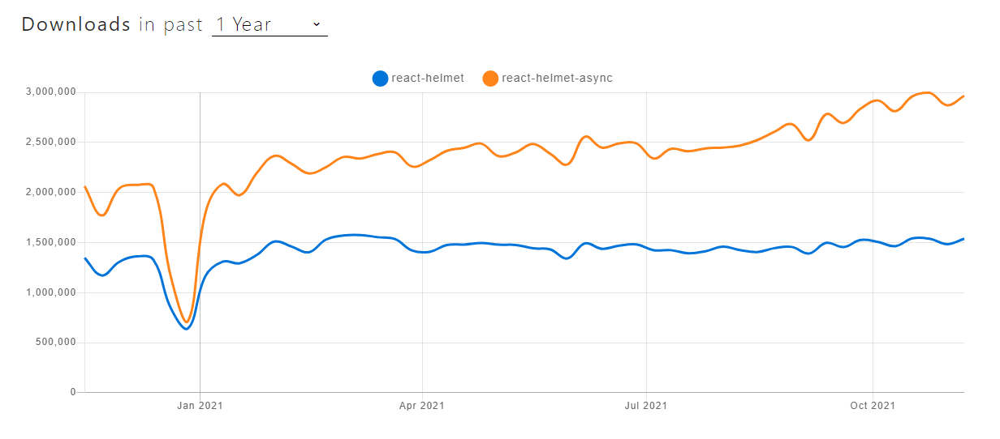

こぷらです。

Gatsby で作成した Web ページに meta 情報を埋め込むために [`react-helmet-async`](https://github.com/staylor/react-helmet-async) を使ってみました。
もともと [`react-helmet`](https://github.com/nfl/react-helmet) を使っていたのですが、年単位でメンテナンスされていなかったのが気になったので変えてみました。
界隈的にも `react-helmet-async` を使うほうがメジャーっぽいです。



変更自体はとても簡単にできます。
ただ実際にやってみると、Gatsby のビルド方法について学ぶ部分が多いと思います。
それでは早速やってみましょう。

## パッケージインストール

まずは必要なパッケージのインストールです。

```shell
yarn add react-helmet-async gatsby-plugin-react-helmet-async
```

プラグインのドキュメントで `react` および `react-dom` の最小バージョンが 16.6 とあるので、それ以下のバージョンを使っているならアップデートをしておきましょう。

> react-helmet-async requires your react and react-dom to be at least 16.6.0. If they’re older than that, you’ll need to upgrade them:
> <cite>gatsby-plugin-react-helmet-async | <https://www.gatsbyjs.com/plugins/gatsby-plugin-react-helmet-async/?=helmet></cite>

```shell
yarn add react@^16.6.0 react-dom@^16.6.0
```

ついでに不要になった `react-helmet` 関連のモジュールをアンインストールします。

```shell
yarn remove react-helmet gatsby-plugin-react-helmet
```

## 使い方

### Helmet コンポーネントの置換

各種タグの追加は `react-helmet` と同じです。
そのため、まず `Helmet` コンポーネントのインポート先だけを変えます

```JavaScript
// import { Helmet } from 'react-helmet'
import { Helmet } from 'react-helmet-async'
```

また、gatsby プラグインも変更しておきます。

```JavaScript:title=gatsby-config.js
module.exports = {
  plugins: [
    // `gatsby-plugin-react-helmet`, 削除
    `gatsby-plugin-react-helmet-async`,  // 追加
  ]
}
```

### HelmetProvider でラップする

そして `react-helmet-async` を使うためには、Web サイトのルート要素を `HelmetProvider` コンポーネントでラップする必要があります。
[ドキュメント](https://github.com/staylor/react-helmet-async) では以下のように紹介されています。

```JavaScript
import React from 'react';
import ReactDOM from 'react-dom';
import { Helmet, HelmetProvider } from 'react-helmet-async';

const app = (
  <HelmetProvider>
    <App>
      <Helmet>
        <title>Hello World</title>
        <link rel="canonical" href="https://www.tacobell.com/" />
      </Helmet>
      <h1>Hello World</h1>
    </App>
  </HelmetProvider>
);

ReactDOM.hydrate(
  app,
  document.getElementById(‘app’)
);
```

Gatsby を使っている場合、ここでちょっと苦戦しました。
というのも、ルート要素を構成するスクリプトがどこにあるかわからなかったからです。
Gatsby のドキュメントを探してみたところ、こんなページが見つかりました。

<div class="iframely-embed"><div class="iframely-responsive" style="height: 140px; padding-bottom: 0;"><a href="https://www.gatsbyjs.com/docs/reference/config-files/gatsby-ssr/" data-iframely-url="//cdn.iframe.ly/WdmYm2q?card=small"></a></div></div><script async src="//cdn.iframe.ly/embed.js" charset="utf-8"></script>

このページでは、Gatsby がビルド時に HTML ファイルへ変更を加えるための API を解説しています。
その中の `wrapRootElement` API が、名前の通りルート要素を別の要素でラップするためのもので、まさに今回求めていた機能でした。
`HelmetProvider` をラップするために、この API を使ってみます。

### wrapRootElement API を使って HelmetProvider をラップする

`wrapRootElement` API を呼び出すためには、プロジェクトルートに `gatsby-ssr.js` ファイルを作成する必要があります。
私のサイトは TypeScript で構築しているので、`gatsby-ssr.tsx` を作成しました。
ファイルの中身は以下のとおりです。

```TypeScript:title=gatsby-ssr.tsx
import * as React from 'react'
import type { GatsbySSR } from 'gatsby'
import { HelmetProvider } from 'react-helmet-async'

export const wrapRootElement: GatsbySSR['wrapRootElement'] = ({ element }) => {
  return <HelmetProvider>{element}</HelmetProvider>
}
```

NamedExport で `wrapRootElement` API を定義し、`<HelmetProvider>` でラップした RootElement を返しています。
これでサイトを立ち上げると、無事に Helmet 要素が追加されていることが確認できるはずです。

ちなみに、ドキュメント上では以下のように Gatsby Browser API と同時に使うことを推奨しているので、それに従って `gatsby-browser.tsx` も変更しておきましょう。

> Note: There is an equivalent hook in Gatsby’s Browser API. It is recommended to use both APIs together.
> <cite> Gatsby Server Rendering APIs | <https://www.gatsbyjs.com/docs/reference/config-files/gatsby-ssr/></cite>

```TypeScript:title=gatsby-browser.tsx
import * as React from 'react'
import { GatsbyBrowser } from 'gatsby'
import { HelmetProvider } from 'react-helmet-async'

export const wrapRootElement: GatsbyBrowser['wrapRootElement'] = ({
  element,
}) => {
  return <HelmetProvider>{element}</HelmetProvider>
}
```

ちなみに、Gatsby SSR API はビルド時に、Gatsby Browser API はブラウザでのレンダリング時に呼ばれます。
この辺の仕様については後日別記事でまとめようと思います。

## まとめ

今回は Gatsby で `react-helmet-async` を使う方法を紹介しました。
ちょっと苦戦しましたが、便利な API が提供されていたため、なんとか実装できました。

実装できただけでなく、 Gatsby SSR API を使うことで HTML ファイルに任意の変更を加えられることを知れたのが一番の収穫でした。
他にも応用できそうなので、Gatsby の開発で困っている人は、まず API を確認してみてはいかがでしょうか。

それでは。
