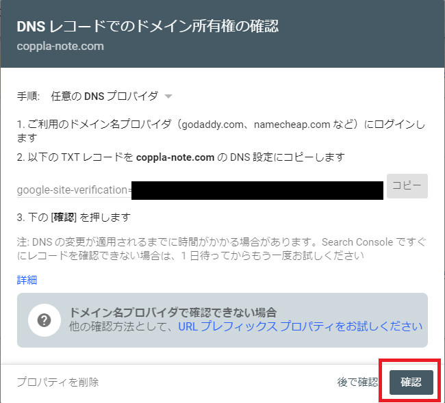

こぷらです。
今回は、Gatsby で作成したブログを Google Search Console に正しくインデックス登録する方法を紹介します。
また Gatsby で作成したブログが、正しくインデックス登録されるためのプラグイン設定方法も紹介します。

## インデックス登録とは

Web サイトへアクセスしてもらう主だった方法に、Google 検索からのアクセスがあると思います。
Google 検索結果の一覧に表示されるためには、このドメインに Web サイトがあるということを教える必要があります。
教えたドメイン内のコンテンツを解析し、ページ内容を「Google インデックス」というデータベースに保存します。
この一連の作業を **インデックス登録** といいます。
インデックス登録されたコンテンツは、以後 Google 検索時に検索対象として参照されるようになります。


新しい Web サイトを公開後、しばらくすれば Google が勝手に Web サイトを見つけてインデックス登録してくれるそうです。
そのため過度に心配する必要はありませんが、実際にインデックス登録されるまでに長くて数ヶ月かかることもあるそうなので、今回は能動的に登録してみます。

## インデックス登録の確認

結構前に作ったままだったけど、自分のサイトはインデックス登録されてるのかわからない、という人は次の方法を試してみてください。

1. Google を開く
2. 検索ワードに `site:{your-domain}` を指定して検索
    - 登録されてない場合
    
    - 登録されている場合
    

検索結果にドメインの Web サイトが表示されていれば、Index に登録されていることになります。
もし登録されていなければ、以下の登録処理を行ってみてください。

## Google Search Console を使ったインデックス登録方法

Google のインデックス登録には [Google Search Console](https://search.google.com/search-console) を使用します。
こちらは登録したドメインについて Google 検索結果の分析を行うツールです。
Google 検索結果の分析とは、以下のようなことを指します。

- 検索されたキーワード一覧
- 検索結果表示時の掲載順位やクリック率など
- 検索時に抱えている問題点の指摘

これら分析を行うための第一歩として、Google Search Console を使ってインデックス登録を申請することができます。
具体的な手順は以下のとおりです。
なお、登録のためには DNS サーバーの設定が必要なため、設定画面にアクセスできることを確認しておいてください。

1. Google Search Console を開く
   - Link: <https://search.google.com/search-console>
2. ドメインを入力して続行ボタンをクリック

    
3. 登録に必要な DNS レコードが生成されるので、レコードをコピーする

    
4. 自身のドメインで使用している DNS サーバーの設定画面にアクセスする
    - 以後は Azure DNS ゾーンを例に解説
5. Azure DNS ゾーンを開き 「+ レコードセット」 をクリック

    
6. 名前を "@", 種類を ”TXT” にして、値に先程コピーしたレコードを入力して OK
   - 名前の "@" は自ドメインを表す省略記号

    
7. Google Search Console に戻り、確認ボタンをクリック

    
8. 所有権の確認ができれば作業完了

    

これで作業は完了です。
注意点として、ここまでの作業はあくまで登録申請であり、作業が終わったら直ちに Google 検索に反映されるわけではありません。
私の場合は、次の日の朝には登録されていることが確認できました。

一通りの作業が完了すると、Google Search Console の管理画面に移動します。
今後はこの管理画面で検索結果の分析が行なえますので、定期的にチェックしましょう。

## Gatsby プラグインの設定

Index 登録申請を行ったら、Web サイトの SEO 設定も見直しておきましょう。
私のブログは [gatsby-starter-blog](https://www.gatsbyjs.com/starters/gatsbyjs/gatsby-starter-blog/) というテンプレートを使用しているのですが、デフォルト設定では不十分だったので、変更した内容を共有しておきます。

### gatsby-plugin-robots-txt

Google がサイト内のコンテンツを自動収集する際に手助けをするファイル `robots.txt` を作成するプラグインです。
デフォルトの設定だと sitemap のパスが誤っていたので修正します。

```javascript:title=gatsby-config.js
module.exports = {
  siteMetadata: {
    siteUrl: 'https://www.example.com'
  },
  plugins: [
    {
      resolve: 'gatsby-plugin-robots-txt',
      options: {
        host: siteUrl,
        // sitemap: `${siteUrl}/sitemap-index.xml`,  // 以下のように修正
        sitemap: `${siteUrl}/sitemap/sitemap-index.xml`,
        policy: [{ userAgent: '*', allow: '/' }],
      },
    },
  ]
};
```

テンプレートではサイトマップの生成に `gatsby-plugin-sitemap` というものを使っています。
このプラグインはビルド時にサイトマップを自動生成するのですが、デフォルトでは `/sitemap/sitemap-index.xml` が生成されます。
また `robots.txt` を生成するプラグイン `gatsby-plugin-robots-txt` ではサイトマップを root 直下に指定されています。
このままでは正しいサイトマップのパスが反映されないため、修正しました。
また、ソースコード内に `/statics/robots.txt` があると、プラグインの結果を上書きしてしまうので、これも削除してしまいます。

## まとめ

今回は自作 Web サイトを Google のインデックスに登録する方法を紹介しました。
一度やればその後は Google が定期的にサイトのチェックをするようになるので、早めにやってしまうのが良いでしょう。

より検索されやすくするためには、さらなる SEO 対策が必要になるとは思いますが、とりあえずの第一歩はこのくらいで十分だと思います。
小手先の SEO 対策よりもコンテンツを充実させたいと思います。

それでは。
