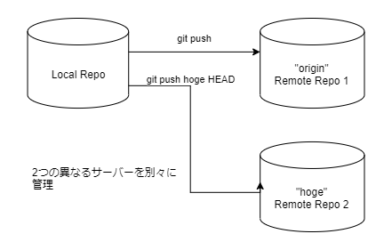
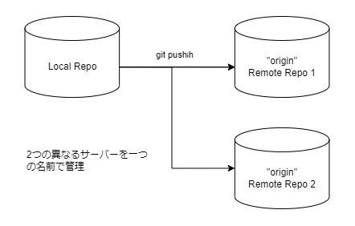

こぷらです。
今回は 1 回のコマンドで複数のリモートリポジトリへ Push を行う方法を紹介します。

ちょっとした理由で、あるソースコードを複数のリモートリポジトリで管理したい事がありました。
両者を完全に同期させたかったので、通常の `git push` コマンドで同時に更新できることが理想でした。
理想とする方法を実現する手段がわかったので、みなさんに共有したいと思います。

## TL;DR

仰々しく話し始めましたが、単に remote に設定している名前に対して、複数のリモートリポジトリを設定できますというだけの話です。

```shell
> git remote -v
origin  https://your/first/repositorry.git (fetch)
origin  https://your/first/repositorry.git (push)
> git remote set-url --add origin https://your/secondary/repositorry.git
> git remote -v
origin  https://your/first/repositorry.git (fetch)
origin  https://your/first/repositorry.git (push)
origin  https://your/secondary/repositorry.git (push)
```

## この機能が必要になった経緯

自分の場合は GitHub 上でのソース管理と、社内サーバーにしかつながらないテスト用の PC への共有を実現するために使いました。

今回の内容を知る前までは、GitHub 用と社内サーバー用の二つの remote 名を用意していました。
普段の開発では、GitHub 上に Push すれば良いので特に問題はありません。
しかし社内でテストする際には、最新版を一度社内サーバー上のリモートリポジトリに Push して、テスト用の PC から Pull してテストしていました。

このような使い方だと社内サーバーに Push し忘れたり、テスト前に最新版になっているか気を回す必要があり煩わしく思うことが多々ありました。

今回複数のリモートリポジトリを設定することによって、煩わしいことを考えずに常に期待通りの動作をしてくれるようになりとても満足です。

## git-remote コマンド

本記事で伝えたいことは以上で終わりですが、かんたんに解説をしておきます。

[git remote](https://git-scm.com/docs/git-remote) コマンドでは Tracking 先となる リモートリポジトリを管理することができます。
ここで言う管理とは、リモートの URL にわかりやすい名前をつけることで実現しています。
`git push origin HEAD` の `origin` に当たる部分がそれです。
名前をつけることで、`push` や `pull` などのリモートとの同期をとるコマンドで参照先をかんたんに変更することができます。

新しいリモートリポジトリの追加は非常にかんたんです。
まず `git remote add <name> <url>` コマンドを使用することで、新しいリモートリポジトリと識別名を登録します。
登録後は `git push remote-name HEAD` のように名前を指定することでリモートリポジトリを使い分けられます。

```shell
> git remote add hoge https://new/repo.git
> git remote -v
hoge  https://new/repo.git (fetch)
hoge  https://new/repo.git (push)
> git push -u hoge HEAD
```



なお `origin` という名前は特別なので、名前が指定されてないときはデフォルトで `origin` が使われます。
そのため、普段は `origin` だけ一度設定してしまえば、remote の名前などは意識しなくて住むようになっています。

余談ですが、あくまで名前を参照しているだけなので、`git push https://exsample.git HEAD` というふうに URL を直接指定することも可能です。

## 複数のリモートリポジトリを一つの名前で管理する

本題ですが、この `origin` などの remote の名前に対して、リモートリポジトリの URL を複数設定することが可能です。
`git remote set-url` コマンドの `--add` オプションを使うことで、設定済みの名前に2つ目の URL を登録可能になります。

```shell
> git remote -v
origin  https://your/first/repositorry.git (fetch)
origin  https://your/first/repositorry.git (push)
> git remote set-url --add origin https://your/secondary/repositorry.git
> git remote -v
origin  https://your/first/repositorry.git (fetch)
origin  https://your/first/repositorry.git (push)
origin  https://your/secondary/repositorry.git (push)
```

上記例のように、`origin` に複数の URL を登録すると、以後 `push` コマンド実行時に2つのリモートリポジトリに Push するようになります。

ちなみに、`pull` をする際には `(fetch)` で指定されているリポジトリから取得することになります。
上記の例だと `origin  https://your/first/repositorry.git (fetch)` の行のことです。
`(fetch)` に設定されたパラメータは変えることができず、最初に add で追加したものになります。
そのため、順番に気をつけて設定してください。



## まとめ

今回は知っているとちょっと便利な `git remote` コマンドの機能を紹介しました。
使う場面はそれほど多くないかもしれませんが、参考になれば幸いです

ちなみにこの方法は [GtiPython](https://github.com/gitpython-developers/GitPython) というライブラリを使おうとドキュメントを眺めていたときに気づきました。
[Git のドキュメント](https://git-scm.com/docs/git-remote)にもばっちり記載されてます。
やっぱりチュートリアルだけでわかった気にならず、一度は公式ドキュメントに目を通さないとだめですね。

それでは。
