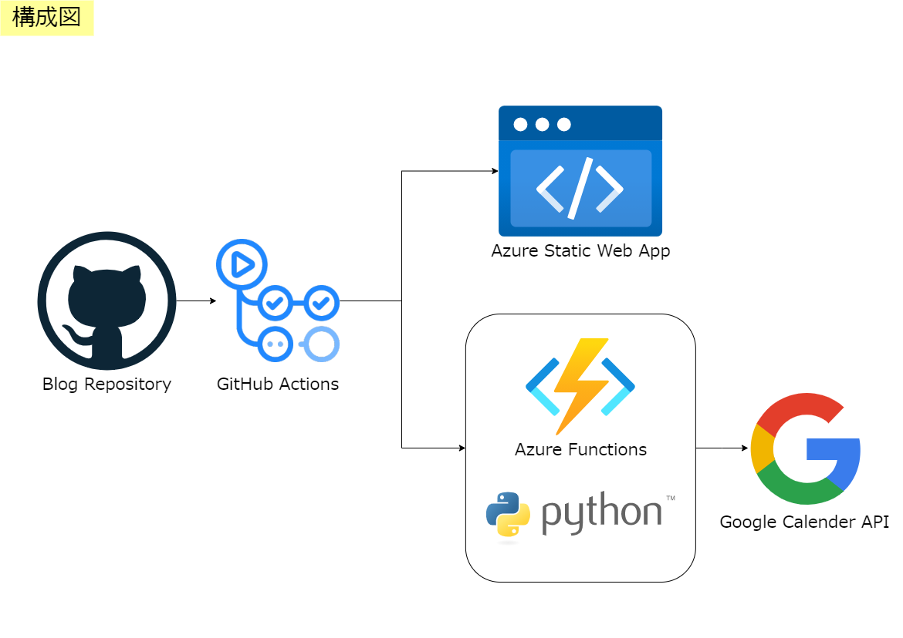
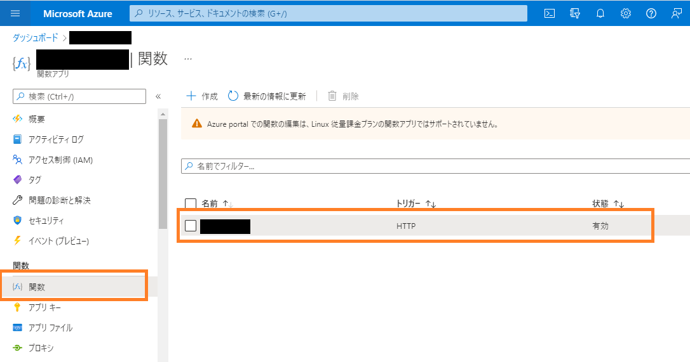
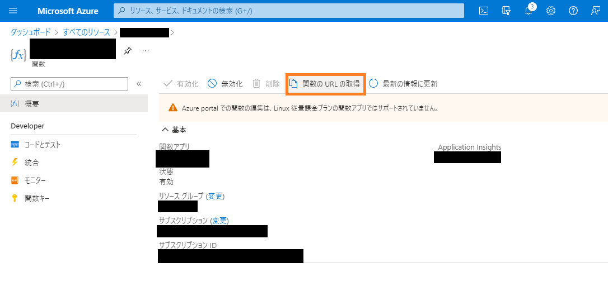

こぷらです。
今回は自作のブログモチベ向上ツールを紹介します。

ブログを書き続けるのって大変ですよね。今までもすでに2つほどブログを作っては潰しています笑。
3度目の正直ということで、今回は今までの反省を踏まえモチベ向上のために色々なことを試しています。
その一つが、今回紹介する「記事投稿時に Google カレンダーへイベントを追加する Bot」です。

それでは早速内容を紹介したいと思います。

## 目次

```toc
```

## 概要

今回紹介するツールは「記事投稿時に Google カレンダーへイベントを追加する Bot」です。
作ったばかりでアクセス数も少なくレスポンスもないので、なにかやってる感がほしいと思って作りました。

大体半日くらいで作ったツールですが、非常に効果が高いと感じてます。
やった感があるのはもちろんのこと、自分のサボり具合までしっかり可視化されてしまいます。
おかげで、カレンダーを見るたびにブログやらなきゃ。。。という気分になります。

もしブログのモチベが続かないと悩んでいる人がいたら、このアイデアを参考にしてみてください。

## 構成



システム構成図はこのようになります。
ブログは GitHub で管理しているので、 GitHub Actions を利用して Bot を起動しています。
その際に Azure Static Web Apps のデプロイ用の Action と今回作成した Bot 用のアクション2つを実行しています。

また、今回の肝となる Bot 側は Azure Functions を利用しています。
Python で Google Calender API を利用したスクリプト作成し、カレンダーへのイベント追加を実行しています。

それでは実際のコードを見てみましょう。

## Python で Google カレンダー API を使う

[Python で Google Calender API を使う方法](/content/posts/tutorial/google-calendar-api)は別の記事で紹介済みです。
そのため、ここでは実際に使うめに必要な最小限の紹介にとどめます。
ちなみに API を利用するためにはサービスアカウントを使用しています。

```Python
import datetime

from googleapiclient.discovery import build
from google.oauth2 import service_account


# API の使用対象を Calender API 設定
SCOPES = ['https://www.googleapis.com/auth/calendar']


def add_posted_event():
    """ Add posted event at the primary calendar
    """
    # ダウンロードした認証情報ファイルを読み込む
    creds = google.auth.load_credentials_from_file(
      'credentials.json', SCOPES
    )[0]

    # Calender API を利用するクライアントを生成
    service = build('calendar', 'v3', credentials=creds)

    # Call the Calendar API
    now = datetime.datetime.utcnow()
    body = {
        'summary': 'Posted',
        'start': {
            # Add `Z` at the end of the timestamp to show it is utc time.
            'dateTime': now.isoformat() + "Z",
            'timeZone': 'Asia/Tokyo',
        },
        'end': {
            'dateTime': (now + datetime.timedelta(minutes=5)).isoformat() + "Z",
            'timeZone': 'Asia/Tokyo',
        },
    }
    try:
        event = service.events().insert(
            calendarId="YourCalenderID@google.com",
            body=body
        ).execute()
    except Exception as e:
        logging.error(e.with_traceback())
        event = None

    return event


add_posted_event()
```

関数 `add_posted_event()` を実行すると、指定したカレンダーの現在時刻に `Posted` という名前のイベントが追加されます。
実際に作成されるイベントの詳細内容は以下の通りです。

```Python
now = datetime.datetime.utcnow()
body = {
    'summary': 'Posted',
    'start': {
        # Add `Z` at the end of the timestamp to show it is utc time.
        'dateTime': now.isoformat() + "Z",
        'timeZone': 'Asia/Tokyo',
    },
    'end': {
        'dateTime': (now + datetime.timedelta(minutes=5)).isoformat() + "Z",
        'timeZone': 'Asia/Tokyo',
    },
}
```

summary に表示名、`start` と `end` に開始/終了時間を記載しています。
開始時間と終了時間はどちらもないとエラーになるので、今回は 5 分間のイベントを作成してます。

```Python
event = service.events().insert(
    calendarId="YourCalenderID@google.com",
    body=body
).execute()
```

API の呼び出しを行っています。
引数 `calendarId` に先程コピーしたカレンダーの ID を記載します。

実際に実行していただければ、カレンダーにイベントが追加されることを確認できると思います。

## Azure Functions を利用した自動投稿

次に Google Calender へ自動投稿を行う API を用意します。
ブログが Azure 上にホストされているので、それに合わせて Azure Functions を使います。
Azure Functions とは Microsoft が運営するクラウドインフラの一つで、俗に言うサーバーレスサービスです。

<div class="iframely-embed"><div class="iframely-responsive" style="height: 140px; padding-bottom: 0;"><a href="https://docs.microsoft.com/ja-jp/azure/azure-functions/functions-overview" data-iframely-url="//cdn.iframe.ly/Cyq5zyp"></a></div></div><script async src="//cdn.iframe.ly/embed.js" charset="utf-8"></script>

それでは早速 API を準備しましょう。
まずは Http Trigger で起動される Python プロジェクトを作成します。
詳細は省きますが、[Functions の使いかたは別記事で紹介している](/posts/tutorial/azure-functions/)ので、そちらを御覧ください。

まず Http リクエストが有った際の処理を記載します。
先程の Calender API を利用するサンプルを以下のように修正します。

```Python:title=__init__.py
import datetime
import logging
import os

import azure.functions as func
from googleapiclient.discovery import build
from google.oauth2 import service_account


# API の使用対象を Calender API 設定
SCOPES = ['https://www.googleapis.com/auth/calendar']


def main(req: func.HttpRequest) -> func.HttpResponse:
    """ Run process when get http request
    """
    logging.info('Python HTTP trigger function processed a request.')

    # カレンダーにイベントを追加する
    event = add_posted_event()

    # イベントの追加に成功したら200, 失敗したら 500 を返す
    if event:
        msg = f"event is created {event.get('htmlLink')}"
        logging.info(msg)

        return func.HttpResponse(msg, status_code=200)
    else:
        msg = "Fail to insert event"
        logging.error(msg)
        return func.HttpResponse(msg, status_code=500)


def add_posted_event():
    """ Add posted event at the primary calendar
    """
    # サービスアカウントの認証情報を環境変数から取得
    info = {
        "private_key": os.environ.get("GOOGLE_PRIVATE_KEY", "").replace('\\n', '\n'),
        "client_email": os.environ.get("CLIENT_EMAIL", ""),
        "token_uri": os.environ.get("TOKEN_URI", "")
    }
    # サービスアカウントの認証
    creds = service_account.Credentials.from_service_account_info(
        info, scopes=SCOPES
    )

    # Calender API を利用するクライアントを生成
    service = build('calendar', 'v3', credentials=creds)

    # Call the Calendar API
    now = datetime.datetime.utcnow()
    body = {
        'summary': 'Posted',
        'start': {
            # Add `Z` at the end of the timestamp to show it is utc time.
            'dateTime': now.isoformat() + "Z",
            'timeZone': 'Asia/Tokyo',
        },
        'end': {
            'dateTime': (now + datetime.timedelta(minutes=5)).isoformat() + "Z",
            'timeZone': 'Asia/Tokyo',
        },
    }
    try:
        event = service.events().insert(
            calendarId=os.environ.get("CALENDER_ID", ""),
            body=body
        ).execute()
    except Exception as e:
        logging.error(e.with_traceback())
        event = None

    return event
```

主な変更点は 2 つです。
1 つ目は、Http リクエストを受け取ったときの処理を追加したことです。
関数 `main` で受け取って、イベントの挿入に成功したら 200 を、失敗したら 500 を返します。

```Python
def main(req: func.HttpRequest) -> func.HttpResponse:
    """ Run process when get http request
    """
    logging.info('Python HTTP trigger function processed a request.')

    # カレンダーにイベントを追加する
    event = add_posted_event()

    # イベントの追加に成功したら200, 失敗したら 500 を返す
    if event:
        msg = f"event is created {event.get('htmlLink')}"
        logging.info(msg)

        return func.HttpResponse(msg, status_code=200)
    else:
        msg = "Fail to insert event"
        logging.error(msg)
        return func.HttpResponse(msg, status_code=500)
```

2 つ目は、サービスアカウントの認証方法です。
最初のサンプルでは json ファイルを読み込んでましたが、サーバーレスでファイルを置いておけないため、環境変数から読み込むようにしました。
以下例の `dict` 型変数 `info` のキーと同じキーの値を、 json ファイルから抜き出して環境変数に設定しています。

```Python
# サービスアカウントの認証情報を環境変数から取得
info = {
    "private_key": os.environ.get("GOOGLE_PRIVATE_KEY", "").replace('\\n', '\n'),
    "client_email": os.environ.get("CLIENT_EMAIL", ""),
    "token_uri": os.environ.get("TOKEN_URI", "")
}
# サービスアカウントの認証
creds = service_account.Credentials.from_service_account_info(
    info, scopes=SCOPES
)

# Calender API を利用するクライアントを生成
service = build('calendar', 'v3', credentials=creds)
```

スクリプトを修正後 Functions にデプロイして、動作確認をしてみてください。
Azure Portal からプロジェクトを開き、関数の URL を取得しブラウザからアクセスしてみれば、Google Calender にイベントを追加できるはずです。





## Github Actions

最後に、これまでに作成した API を GitHub Actions を使って、ブログ記事投稿時に呼び出すようにします。
早速 Actions の内容を紹介します。

```yaml
name: Add Posted Event

on:
  push:
    branches:
      - main
    paths:
      - content/**

jobs:
  hook:
    runs-on: ubuntu-latest
    name: Deploy Hook Job
    steps:
      - run: curl ${{ secrets.DEPLOY_HOOK_URL }}
```

処理の中身は curl で先程作成した API の URL を呼び出しているだけです。
工夫した点として、ブログ記事を保存しているディレクトリが更新されたときだけ実行するようにしました。

GitHub Actions では、CI の実行タイミングをかなり細かく制御できます。
今回は [`on.push.paths`](https://docs.github.com/ja/actions/learn-github-actions/workflow-syntax-for-github-actions#) に`content/**` を設定することで、記事を保存している `content` ディレクトリ内の変更全てに反応するようにしています。

## まとめ

今回は、自作の Google Calender Bot を紹介しました。
記事は長くなってしまいましたが、Azure や GitHub Actions など便利なサービスを使うことで、非常に素早くリリースまで行うことができました。

ちょっとした便利ツールの開発って、何故か本業よりも無性に楽しいですよね。
ブログを書かずにブログの手助けツール作りに熱中しちゃうのは本末転倒感ありますけど、、、
学生時代にテスト勉強してたらいつの間にか部屋掃除してたあの感覚に似てます。

今後も、こんな感じの自作ツールを紹介できたらなと思います。

それでは。
