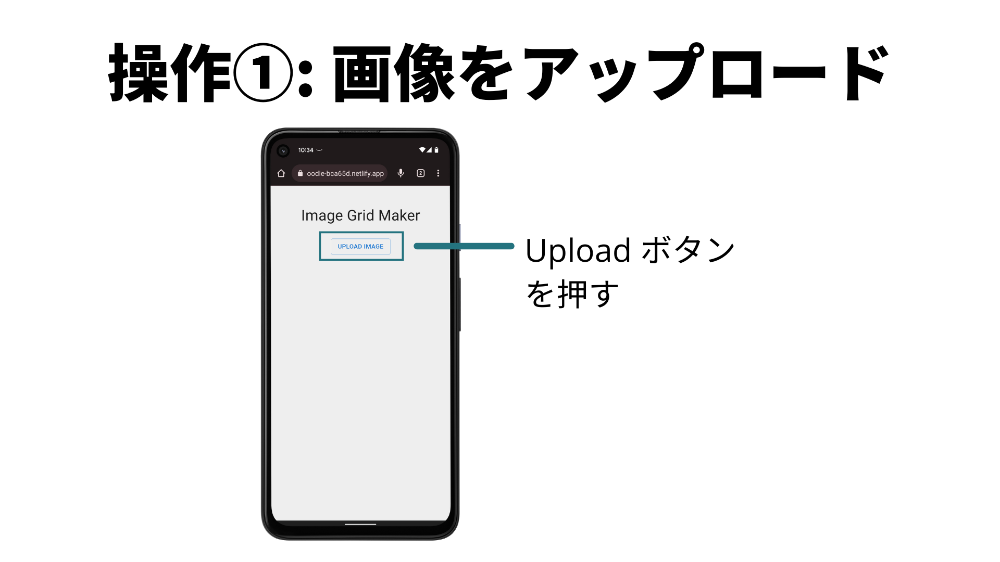
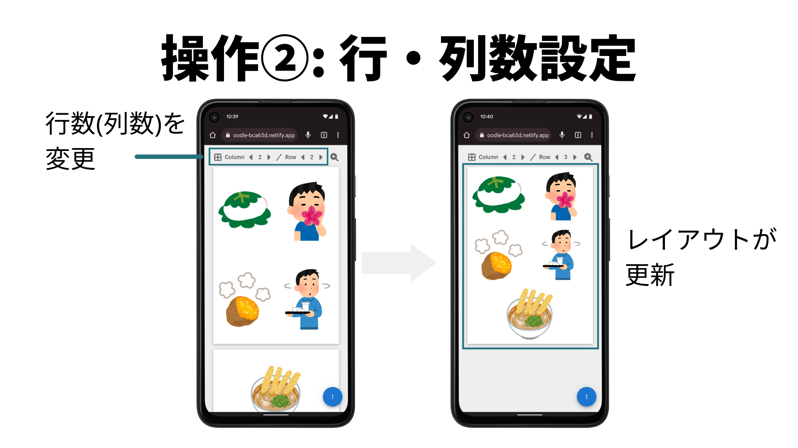
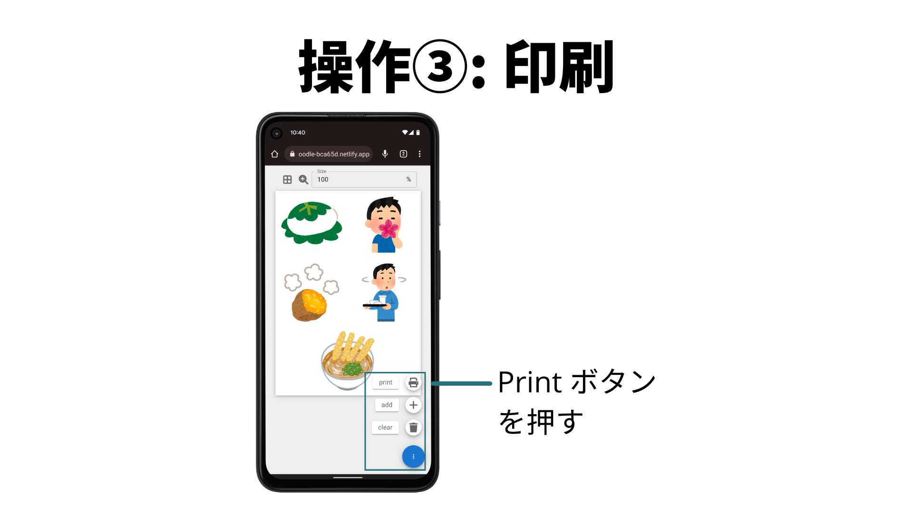
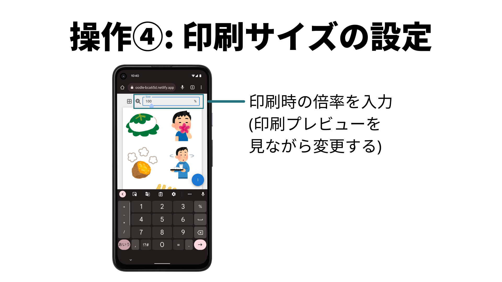

こぷらです。
今回は、個人で開発したアプリ ’Collage Printer’ について紹介します。
このアプリは、画像を Grid (格子状) に並べるコラージュ画像を A4 サイズで作成・印刷するためのものです。
[こちらのリンク](https://delicate-snickerdoodle-bca65d.netlify.app)からアプリを使うことができるので、試しに使ってみてください。

リンク先へ行ってみた方ならわかると思いますが、本アプリは MVP だけ実装したプロトタイプです。
検索流入などを見ながら、需要次第で機能を追加していくつもりです。
もしこのアプリがいいなと思ったら、[Twitter](https://www.coppla-note.net/posts/products/collage-printer/) でいいねや [Github](https://github.com/shin-hama/image-grid) で Star をもらえると助かります。

この記事では、簡単な使い方と工夫した点などを紹介したいと思います。
紹介だけで終わってしまうのも味気ないですしね。

それでは早速始めましょう

```toc
```

## アプリの背景

### アプリ作成の動機

このアプリは趣味でスクラップブックを作っている知人の要望をもとに作りました。
今まで写真をブックへ貼るために、ノートアプリ上に縮小した画像をコピペして印刷ということをやっていました。
実際にやってみるところを想像していただければ、いろんな写真をコピペしてサイズとレイアウトを調整するのは意外と面倒なことがわかると思います。
テスト仕様書とかにテスト結果のスクショをコピペするのもすごい面倒ですしね。

このくらいなら簡単に作れそうだと思い作ってみたのが今回のアプリです。
実際作り始めて3日、実働時間としては5~6時間くらいで作れました。

### 技術選定

シンプルなアプリなのでフロントエンドだけで完結させました。
使用したフレームワーク、ライブラリは以下のとおりです。

- React: 18.1
- Typescript: 4.6.4
- MUI: 5.6.4
- react-to-print

アプリは `create-react-app` で作成し Netlify にデプロイしています。

## 使い方

Collage Printer のメイン機能は、格子状に並べた画像を A4 サイズで印刷することです。
印刷するまでに以下 3 ステップの操作が必要になります。

1. 画像をアップロード
2. Grid の行・列数を設定
3. 印刷
4. 印刷サイズの設定　(オプション)

一つづつ順番に見ていきましょう。

### 1. 画像をアップロード



Collage Printer を開くと、画像アップロードボタンがあります。
クリックすると、操作中の端末内にある画像を選択することができます。
複数枚の画像が選択可能なので、並べたい画像を自由に選んでください。
あとから追加することもできるので、まずは選んでみましょう。

ちなみに、アップロードされた画像はどこにも保存されません。
また、一度ページを閉じたらコラージュ画像も削除されるため、プライベートな画像でも安心して使えるようにしています。

### 2. Grid の行・列数を設定



画像を選択するとコラージュ画像のプレビューが表示されます。
この画面では Grid のレイアウトを変更することができます。
画面上部に行・列数の設定があり、左右のボタンを使って変更することができます。
設定が変わると、数値に合わせて A4 サイズ内に画像が均等に配置されます。
現在は 1×1 ~ 4×4 までの値を設定可能です。

### 3. 印刷



画像を設定したらいよいよ印刷です。
画面右下のアイコンを選択すると、サブメニューが表示されます。
その中の印刷ボタンを選択することで、印刷画面が開きます。

なお、端末によっては削除できない余白が生まれ、レイアウトが崩れてしまいます。
その場合は事項の印刷サイズの設定を行ってください。

### 4. 印刷サイズの設定(オプション)



最後に印刷用の設定です。
端末によっては、印刷時に自動的に余白が設定されてしまいます。
余白があるとプレビューで表示したとおりに印刷できないため、サイズを調整してください。

画面上部にある行・列数設定の横の虫眼鏡アイコンをクリックしてください。
サイズ設定フォームが現れるので、任意の値を入力してから再度印刷画面を開きます。
印刷画面のプレビューでレイアウトが崩れていないことを確認したら、印刷を行ってください。

## 工夫点

### 印刷用 css とプレビュー用の css を定義

ブラウザの内容をそのまま印刷すると、設定ボタンや影が写り込んでしまいます。
そのため、印刷時とブラウザ上での閲覧時に異なる css が適用されるような css を定義しました。

具体的には、印刷時のスタイルは `@media print` プレビュー時のスタイルは `@media screen` 以下に記述するようにしています。
例えば、画面上には移したいけど、印刷時には消したい要素には以下のように設定します。

```css
@media print {
    .no_print {
        display: none;
    }
}
```

```jsx
import styles from "styles.module.scss"

const NoPrintButton = () => {
  return <button className={styles.no_print}>ボタン</button>
}
```

そして印刷したい要素には、A4 用紙に近い見た目を持つようなスタイルを定義しました。
細かくなりますが、以下が設定した css の全文です。

```css
/* @media を設定しなければ、印刷、プレビューともに適用される */
.paper {
    display: block;
    width: 210mm;
    /* 1mm余裕をもたせる */
    height: 296mm;
    page-break-after: always;
    overflow: hidden;
    box-sizing: border-box;
    position: relative;
    background: transparent;
}

/* プレビュー用のスタイル */
@media screen {
  .paper {
      width: calc(100 / 24 * 21vw);
      height: calc(100 / 24 * 29.6vw);
      /* 背景を白く */
      background: white;
      /* ドロップシャドウ */
      box-shadow: 0 0.5mm 2mm rgba(0, 0, 0, 0.3);
      margin-bottom: 16px;
  }
}
```

この css を適用すると、以下画像のように画面上に用紙のような見た目で表示することができます。

### 自動余白の対処

最初は A4 用の css を適用してしまえば問題なかったので、そのまま知人に使ってもらいました。
ところが、知人環境ではレイアウトが崩れて画像がぶつ切りになってしまいました。
調べたところ、iPhone から印刷するとページに自動で余白が入ってしまうようでした。

この余白はユーザーからもアプリからも制御できない iPhone の仕様だったため、かなり頭を悩ませました。
最初は余白を削除する方法を探してたのですが、おそらく不可能であるとわかったので、印刷物自体のサイズを変更できるようにして対応しました。
それが使い方 4 の [「印刷サイズの設定」](#4-印刷サイズの設定オプション) になります。

## まとめ

今回は個人開発アプリ [Collage Printer](https://delicate-snickerdoodle-bca65d.netlify.app) を紹介しました。
最初に述べたとおり、本アプリは MVP だけ実装したプロトタイプです。
検索流入などを見ながら、需要次第で機能を追加していくつもりです。
もしこのアプリがいいなと思ったら、[Twitter](https://www.coppla-note.net/posts/products/collage-printer/) でいいねや [Github](https://github.com/shin-hama/image-grid) で Star をもらえると助かります。

iPhone の余白について、ユーザーが設定を意識せず使えればベストだったのですが、自分にはどうしようもありませんでした。
ただ、余白を削除することから制御する方針へ転換できたことは、我ながらいいアイデアだったと思いました。
実務でも実現が難しい問題を正面から取り組むより回避するほうがいいことは往々にしてあると思います。
やっぱり個人開発は実務に近い経験がたくさん積めるのがいいですね。

それでは。
