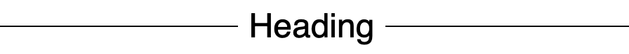

こぷらです。
今回は MUI を使って線で挟まれた見出しを作る方法を紹介します。
線で挟まれた見出しとは以下のようなものです。



ちなみに MUI とはスタイル済みの美しいコンポーネント郡を提供してくれるライブラリです。
[こちら](/content/posts/tutorial/mui-v5)でも紹介しているので、気になる方は御覧ください。
公式のドキュメントは以下になります。

<https://mui.com/>

それでは早速見ていきましょう

## コード例

早速ですが、コード例を紹介します。

<iframe src="https://codesandbox.io/embed/materialuisample-74mud?fontsize=14&hidenavigation=1&module=%2Fsrc%2FHeadBetweenLines.js&moduleview=1&theme=dark"
     style="width:100%; height:500px; border:0; border-radius: 4px; overflow:hidden;"
     title="MaterialUISample"
     allow="accelerometer; ambient-light-sensor; camera; encrypted-media; geolocation; gyroscope; hid; microphone; midi; payment; usb; vr; xr-spatial-tracking"
     sandbox="allow-forms allow-modals allow-popups allow-presentation allow-same-origin allow-scripts"
   ></iframe>

肝になるのは `Box` コンポーネントの `sx` props で設定した `css` 部分です

```js
    <Box
  sx={{
    display: "flex",
    alignItems: "center",
    "&::before, &::after": {
      borderTop: "solid 1px",
      content: '""',
      flexGrow: 1
    },
    "&::before": {
      mr: 1
    },
    "&::after": {
      ml: 1
    }
  }}
>
  <Typography variant="h5">Heading</Typography>
</Box>
```

要素をフレックスボックスで表示して中央揃えします。
その上で、上部の `border` だけが設定された空の疑似要素 `before`, `after` を定義しています。
また各疑似要素に `flexGrow: 1` を設定することで、子要素の外側いっぱいに横線が伸びるようにしています。
最後に見出し周辺を見やすくするための `margin` をセットしています、ここはお好みで。

ちなみに、横線部分は `Box` コンポーネントに分離してあるため、 `Typography` を入れ替えて別のコンポーネントに切り替えても動作します。
文字以外で映えるレイアウトは思いつかないですが、、、
なにかいい案があれば、Twitter なりで教えてくれると嬉しいです。

## まとめ

今回は、MUI の sx props を活用して線で挟まれた見出しを作る方法を紹介しました。
MUI には `Divider` という横線を描画するためのコンポーネントもあるので、そちらを使ってもいいと思います。
ただ、今回はあえて css を使って実装することで、少しでも MUI の依存度を下げてみました。

それでは。
