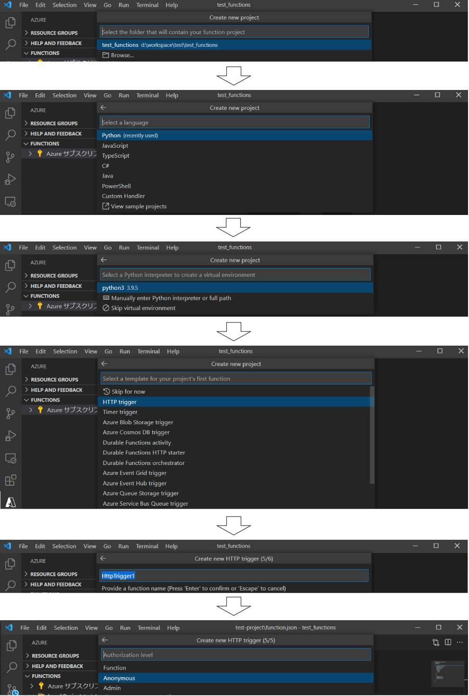
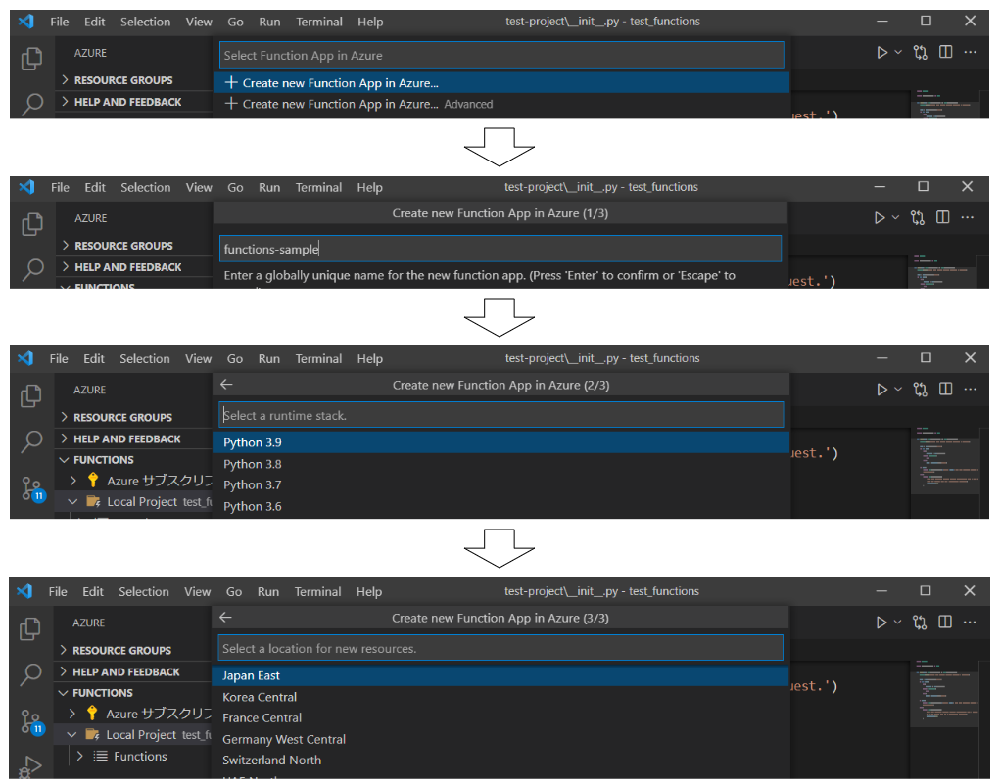

こぷらです。
今回は Microsoft が提供するサーバーレスコンピューティングを担う Azure Functions を使ってみました。
そこで、始める準備から実際に API を呼び出すところまでを、備忘録代わりにまとめておきます。

サーバーレスの仕組みをうまく活用することで、なんとなくで作った既存のスクリプトもかんたんにサービス化することができます。
もし、自分用にスクリプトを組んでみたけど、他人とも共有できるようにしたいと考えている人がいたら、
今回の記事を参考にサーバーレスの導入を検討してみてください。

それでは早速やってみましょう。
記事で紹介したコードは以下の Repository に保存してあります。

<div class="iframely-embed"><div class="iframely-responsive" style="height: 140px; padding-bottom: 0;"><a href="https://github.com/shin-hama/blog-sample/tree/main/FunctionSample" data-iframely-url="//cdn.iframe.ly/K1OxILG?card=small"></a></div></div><script async src="//cdn.iframe.ly/embed.js" charset="utf-8"></script>

## 目次

```toc
```

## Azure Functions とは

Microsoft が提供するクラウドコンピューティングサービスの一つで、サーバーレスなシステムの構築を実現するためのサービスです。
その他の Azure サービスと同様に、柔軟なスケーリングや他サービスとのシームレスな連携を売りにしています。
また VS Code と連携することで、プロジェクトの作成からデプロイまですべての作業を VS Code 上で完結させることも可能です。

[2021 年現在、以下 7 種類の言語に対応](https://docs.microsoft.com/ja-jp/azure/azure-functions/)しています。
※ Functions のバージョンによって言語の対応状況も違うので注意

- C#
- JavaScript
- F#
- Java
- PowerShell
- Python
- TypeScript

### サーバーレスとは

ここ数年人気のシステム構築方法の一つです。
名前からサーバーが存在しないような印象を受けますが、ソフトウェアを動かすためのサーバーは当然存在します。
しかし、サーバーの管理をすべてクラウド側に任せることで、ユーザーはサーバーをないものとして扱うことができるようになっています。

つまりサーバーレスとは、**サーバーを意識せずにロジックの実装だけでサービスが作れる仕組み**と考えるのが、私的に一番しっくりと来ました。

### 結局何が嬉しいの？

サーバーレスを使うことで得られるメリットは数え切れません。
あえて例を上げるなら以下のようなものでしょうか。

- 迅速なサービス開発
- MVP であるロジックへ集中
- API の横展開が容易
- 一元管理

自分の職場での経験を例に出すと、自作の業務自動化ツールの配布なんかにも役立ちました。
避けては通れない面倒な作業ってありますよね。
プログラマーとしては当然自動化を試みたいところですが、それをすると色んな人から自分にも使わせてと声がかかります。
初めて作ったときは実行ファイルを配布したりしてましたが、人が増えるにつれバージョン管理や実行環境構築など対応が面倒になりがちです。

そんなときこそサーバーレスの出番で、自動化ツールをそのままデプロイして API を提供するようにします。
誰でもすぐに使えるようになりますし、自分の手元だけでツールを管理することができます。
合わせて React で適当なフォームを作れば、それっぽい Web アプリが簡単に作れてしまいます。

ちゃちゃっと作って API を提供するって、なんかかっこいいですよね笑。
サーバーレスを使えば、自分みたいなへっぽこプログラマーでもそれができてしまいます。

## Azure を使ってみる

それでは早速使ってみましょう。
今回は Azure Functions を使って、デプロイした API を呼び出すところまでやってみます。
やりたいことの実現まで以下の 4 Step でやっていきましょう。

1. Azure へサインイン
2. 開発環境の構築
3. プロジェクト開発
4. デプロイと実行

### Azure へサインイン

まず最初に Azure へサインインします。
そのためには有効な Microsoft アカウントが必要なので、持っていない方は作成してください。
メールアドレスか電話番号があれば誰でも作成できるはずです。

[Microsoft アカウント作成ページ](https://account.microsoft.com/account/Account?refd=login.live.com&ru=https%3A%2F%2Faccount.microsoft.com%2F%3Frefd%3Dlogin.live.com&destrt=home-index)

アカウントがある方は以下ページに行き、Azure へサインインできることを確認してください。

[Azure Top page](https://azure.microsoft.com/)


### 開発環境の構築

サインインできたら、次に開発環境を構築しましょう。
今回は簡単に始められる VS Code の拡張機能を使う方法を紹介します。
なお、VS Code はすでにインストール済みとして説明します。

1. Azure Functions 拡張機能をインストール

     - [MarketPlace](https://marketplace.visualstudio.com/items?itemName=ms-azuretools.vscode-azurefunctions)
2. サイドバーに追加された Azure アイコンをクリックし Microsoft Account でサインイン


無事サインインできれば準備は完了です。
さっそく開発を進めましょう。

### プロジェクトの開発

Functions にデプロイするためには、管理するための Project が必要になります。
実際にデプロイすると、プロジェクト用のホスト名に各関数ごとのエンドポイントが与えられるよになります。


プロジェクトの作成は VS Code 上で行なえます。
まずはプロジェクト作成用の適当なフォルダを開きます。
サイドバーの Azure アイコンをクリックし、Functions メニューを開きます。
フォルダーアイコンになっている "Create New Project..." ボタンをクリックします。


指示に従ってプロジェクトの初期化をします。
今回は以下の初期設定で作成しました。

- Language: Python 3.9
- Template: HTTP Trigger (HTTP で呼ばれたら実行)
- Auth level: Anonymous (誰でも実行可能)



プロジェクトが作成されると、以下構造のファイル群ができるはずです。

```shell
root\
|- .venv\
|- FunctionName\
  |- __init__.py
  |- function.json
  |- sample.dat
|- .funcignore
|- .gitignore
|- host.json
|- local.settings.json
|_ requirements.txt
```

`root` 直下にはプロジェクトの設定ファイル類があります。
`host.json` はデプロイ先での設定が、`local.settings.json` はローカルでサーバーを建てる際の設定が記載されています。
`.funcignore` はデプロイ時に無視するファイルの一覧です。

`FunctionName` ディレクトリには、関数の実装が含まれています。
`Python` でテンプレートを作成した場合、`FunctionName\__init__.py` がエントリーポイントになります。
`FunctionName\function.json` は関数単位の設定ファイルで、関数の実行方法やエントリーポイントの設定などができます。
`FunctionName\sample.dat` は、Azure Portal 上でテスト実行する際のリクエストボディとして使うデータを定義できます。

実行して見る前に `__init__.py` の中身も見てみましょう。

```python:title=__init__.py
import logging

import azure.functions as func


def main(req: func.HttpRequest) -> func.HttpResponse:
    # 標準の Logger で logging 可能、ログは Azure Portal 上で閲覧
    logging.info('Python HTTP trigger function processed a request.')

    # リクエスト内のクエリから `name` パラメータを取得
    name = req.params.get('name')
    if not name:
        try:
            # クエリになければボディを取得
            req_body = req.get_json()
        except ValueError:
            pass
        else:
            name = req_body.get('name')

    if name:
        return func.HttpResponse(
            f"Hello, {name}. "
            "This HTTP triggered function executed "
            "successfully."
        )
    else:
        return func.HttpResponse(
            "This HTTP triggered function executed successfully. Pass a name "
            "in the query string or in the request body for a personalized "
            "response.",
            status_code=200
        )
```

HTTP リクエストを受け取り、クエリかボディの `name` パラメータを参照します。
最後に `name` の有無に応じたレスポンスを返しています。
次の節で実際の動きを確認してみましょう。

### デプロイと実行

デプロイも VS Code 上から行えます。
まずサイドバーの Azure アイコンをクリックし、Functions メニューの "Deploy to Function App..." をクリックします。


デプロイ先の設定を行うので、指示に従って進めます。
今回は Azure 上にテスト用のサンプルプロジェクトを作成しつつデプロイします。



デプロイが完了したら、[Azure Portal](https://portal.azure.com/) 上で確認しましょう。
ダッシュボードを開くと、先程デプロイした Functions のアプリが確認できるはずです。

クリックして詳細を開くと、URL の項目があるので開いてみます。


以下のような画面が出れば、プロジェクトの作成は成功しています。


それでは、肝心のデプロイしたコードの動作も確認しましょう。

プロジェクトの詳細画面に戻り、サイドメニューの "関数" メニューを開き、デプロイした関数があることを確認します。


関数をクリックして詳細画面を開くと、"関数の URL の取得" という項目があるので、それをクリックして表示された URL をコピーします。


コピーした URL をブラウザのアドレスバーに入力して関数を呼び出すと、先程見た `name` がない状態のレスポンスが表示されるはずです。

## まとめ

今回は Azure Functions を使ってみました。
難しいことを考えず、すぐに API を用意できるのはとても便利です。

プログラムは書けるけどプロダクトは作れないという自分みたいな人は、まずこういう簡単なものをとっかかりにするといいでしょう。

実際に [Azure Functions を使った Bot の紹介](/posts/products/calendar-bot/)もしているので、そちらも参考にしてください。

それでは。
