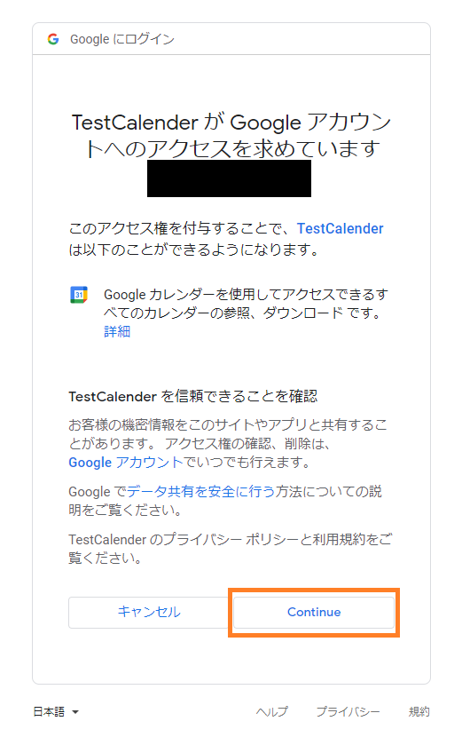

こぷらです。
今回は Python で Google Calendar API を使ってみたので、その方法を記録しておきます。

プライベートの予定管理に Google Calendar を使っていますが、予定を自動で追加してみたいと思い API を使ってみました。
実際に [Google Calendar API を使った Bot](/posts/products/calendar-bot/) は別記事で紹介していますので、参考にしてください。

それでは早速やってみましょう。
この記事の内容は、以下公式ドキュメントに沿った内容になります。

<div class="iframely-embed"><div class="iframely-responsive" style="height: 140px; padding-bottom: 0;"><a href="https://developers.google.com/calendar/api" data-iframely-url="//cdn.iframe.ly/I5ogSFu?card=small"></a></div></div><script async src="//cdn.iframe.ly/embed.js" charset="utf-8"></script>

## 目次

```toc
```

## Google Calendar API の概要

Google Calendar API はその名の通り、 Google Calendar をアプリケーションと連携させるために用意された RESTful API です。
Google Calendar に限らず、Google が運営するサービスの API は Google Cloud Platform というサービスを通して利用することができます。
そのため、まずは Google Cloud Platform について紹介します。

### Google Cloud Platform とは

Google Cloud Platform (以下 GCP) とは Google が提供するクラウドサービスです。
Google が管理運用する一連のクラウドサービスを管理するサービスで、今回扱うような API の管理などもできます。
各種サービスを使うごとに料金が発生する従量課金制で、サービスごとに無料枠も用意されてます。

<div class="iframely-embed"><div class="iframely-responsive" style="height: 140px; padding-bottom: 0;"><a href="https://cloud.google.com/" data-iframely-url="//cdn.iframe.ly/q8UKSK6?card=small"></a></div></div><script async src="//cdn.iframe.ly/embed.js" charset="utf-8"></script>

これについての詳細は紹介しませんが、Google の指示通りやれば難なく始められると思います。
ちなみに Google アカウントとクレジットカードがあれば誰でも使うことができます。

### Calendar API のできること

基本的に Google Calendar でできることは全てできるようです。

- 複数カレンダーの管理
- カレンダーへのイベント追加・削除
- カレンダー内のイベント閲覧
- イベントのリマインド
- 定期イベントの設定
- etc...

各項目の詳細については[ドキュメント](https://developers.google.com/calendar/api)を確認してください

## API を使う準備

Google Calendar API を使うためにはいくつか準備が必要です。

- GCP でプロジェクトを作成する
- Calendar API の有効化
- アカウントの認証方法を作成

ちなみに、以下の内容はすでにできている前提で進めます。

- Google カレンダーが使えるアカウントの作成
- GCP の利用開始
- Python の開発環境構築

### プロジェクトの作成

まずはプロジェクトを作成します。
GCP ではプロジェクト単位でサービスを管理することができます。
サービスを利用するシステムごとにプロジェクトを分けることで、最小限の構成を維持し続けることができます。

それではまず、[Google Cloud Console](https://console.cloud.google.com/) にアクセスしてダッシュボードを開きます。
そしてダッシュボード上部のプロジェクト選択ボタンをクリックし、"新しいプロジェクト" をクリックします。


任意の名前を入力し "作成" をクリックします。場所は組織無しで問題ありません。


プロジェクトの作成が完了すると右上に通知が来るので、プロジェクトを選択ボタンで作成したプロジェクトのダッシュボードを表示します。


以上でプロジェクトの作成は完了です。

### Calendar API の有効化

続いて Calendar API を有効化します。
Google が提供するどの API にも言えることですが、プロジェクトを作成した上で有効化しなければ使えないので注意してください。
武器や防具は持っているだけでは意味がないことと一緒です。

プロジェクトダッシュボード上から左上の "メニュー" / "APIとサービス" / "ライブラリ" を開きます。


API ライブラリの検索画面が表示されるので、"Calendar" で検索します


検索結果から Google Calendar API をクリックし、次のページで "有効にする" をクリックします。


これで API の有効化は完了です。
続いて認証情報を作成しましょう。

### 認証情報の作成

認証情報とは、プログラムがカレンダーを操作することを許可されていることを確認するための情報です。
認証無しで Google カレンダーにアクセスできてしまうと知らない人のデータまで見れてしまうので、設定は必須になります。

設定のためにまずダッシュボードから "メニュー" / "APIとサービス" / "認証情報" を開きます。


設定画面を開くと以下のような画面になります。
今回はこの中の OAuth クライアントとサービスアカウントの 2 つの方法を紹介します。


#### OAuth クライアント

OAuth では、ユーザーの Google アカウントの権限をアプリに移譲することで、アプリがユーザーの代理でカレンダーを操作します。
そのために、アプリを使う際に Google アカウントでログインして、アプリに権限を承認させる必要があります。
不特定多数のユーザーが使うアプリで、それぞれのユーザのカレンダーを連携させたいときに使う方法です。

OAuth 認証を使うためには、まずユーザーに認証の同意を求める画面から作ります。
サイドバーの OAuth 同意画面を選択し、同意画面の作成フォームを開きます。


続いて指示に従って画面の作成を行います。
今回はテスト用なので、以下のような設定にします。

- User Type: 内部
- アプリ名：TestCalender
- ユーザーサポートメール/デベロッパーの連絡先情報：自身のメールアドレス
- Scope：Google Calender API (/auth/calendar)
- テストユーザー：自分の Google アカウント


OAuth 画面の設定が終わったら、認証情報に戻り画面上部の "認証情報を作成" をクリックして "OAuth クライアント ID" を選択します。


アプリケーションの種類を "デスクトップアプリ" にして任意の名前で作成します。


作成が完了したら、クライアント ID とシークレット情報の Json ファイルをダウンロードします。


以上で準備完了です。

## Google Calendar API を OAuth で使ってみる

いよいよ実際にコードを書きます。
今回は Python 3.9 を使って実装しました。

まずは Google の Client ライブラリーをインストールします。
これはユーザー認証や API の実行に必要なものです。
仮想環境が必要であれば事前に作成しましょう。

```shell
pip install google-api-python-client google-auth-httplib2 google-auth-oauthlib
```

続いて以下のようなコードを書きます。

```python:title=client-scripts.py
from __future__ import print_function
import datetime
import os.path
from googleapiclient.discovery import build
from google_auth_oauthlib.flow import InstalledAppFlow
from google.auth.transport.requests import Request
from google.oauth2.credentials import Credentials

# If modifying these scopes, delete the file token.json.
SCOPES = ['https://www.googleapis.com/auth/calendar.readonly']


def main():
    """Shows basic usage of the Google Calendar API.
    Prints the start and name of the next 10 events on the user's calendar.
    """
    creds = None
    # The file token.json stores the user's access and refresh tokens, and is
    # created automatically when the authorization flow completes for the first
    # time.
    if os.path.exists('token.json'):
        creds = Credentials.from_authorized_user_file('token.json', SCOPES)
    # If there are no (valid) credentials available, let the user log in.
    if not creds or not creds.valid:
        if creds and creds.expired and creds.refresh_token:
            creds.refresh(Request())
        else:
            flow = InstalledAppFlow.from_client_secrets_file(
                'credentials.json', SCOPES)
            creds = flow.run_local_server(port=0)
        # Save the credentials for the next run
        with open('token.json', 'w') as token:
            token.write(creds.to_json())

    service = build('calendar', 'v3', credentials=creds)

    # Call the Calendar API
    now = datetime.datetime.utcnow().isoformat() + 'Z' # 'Z' indicates UTC time
    print('Getting the upcoming 10 events')
    events_result = service.events().list(calendarId='primary', timeMin=now,
                                        maxResults=10, singleEvents=True,
                                        orderBy='startTime').execute()
    events = events_result.get('items', [])

    if not events:
        print('No upcoming events found.')
    for event in events:
        start = event['start'].get('dateTime', event['start'].get('date'))
        print(start, event['summary'])


if __name__ == '__main__':
    main()
```

細かい説明は一旦置いて、OAuth Client 作成時にダウンロードした Json ファイルを、
スクリプトの実行フォルダに `credentials_oauth.json` という名前で保存します。
そしてスクリプトを実行すると、以下のような認証画面にリダイレクトされるので、
設定したテストユーザーを選択して承認しましょう。
まだテスト段階のため警告が出ていますが、問題はありません。




認証が完了すると、Calendar API の呼び出しが始まります。
サンプルコードでは、ユーザーの Primary カレンダーから直近10個の予定を取得しています。

```shell
$ python .\src\client_scripts.py
Please visit this URL to authorize this application: https://accounts.google.com/o/oauth2/auth?response_type=code&client_id=889845061362-72cpejqr6svamvo0vrluj6ksrj2lnf3s.apps.googleusercontent.com&redirect_uri=http%3A%2F%2Flocalhost%3A58878%2F&scope=https%3A%2F%2Fwww.googleapis.com%2Fauth%2Fcalendar.readonly&state=KLPyQid2bt6pAgX3nutGSG88Avfg9N&access_type=offline
Getting the upcoming 10 events
2021-10-28 test
2021-10-29T10:00:00+09:00 sample2
```

設定さえできれば簡単に使うことができましたね。
最後にすこしだけコードの解説をします。

```Python
creds = None
# The file token.json stores the user's access and refresh tokens, and is
# created automatically when the authorization flow completes for the first
# time.
if os.path.exists('token.json'):
    creds = Credentials.from_authorized_user_file('token.json', SCOPES)
# If there are no (valid) credentials available, let the user log in.
if not creds or not creds.valid:
    if creds and creds.expired and creds.refresh_token:
        creds.refresh(Request())
    else:
        flow = InstalledAppFlow.from_client_secrets_file(
            'credentials.json', SCOPES)
        creds = flow.run_local_server(port=0)
    # Save the credentials for the next run
    with open('token.json', 'w') as token:
        token.write(creds.to_json())

service = build('calendar', 'v3', credentials=creds)
```

関数の前半は認証部分です。
初めて実行した場合は、`InstalledAppFlow.run_local_server()` メソッドが呼ばれ、認証画面へとリダイレクトされます。

認証が完了すると、サービスを利用するための認証情報が得られます。
認証情報には一定時間使い回せる `token` と、`token` を再発行するための `refresh_token` が含まれています。
この二つを保存して使い回すことで、1度認証したらその後何回でも使えるように書かれています。

そして認証情報を使って作成した Client を `service` 変数に格納します。
以後 API を呼び出す際にはこの `service` を使います。

```python
events_result = service.events().list(calendarId='primary', timeMin=now,
                                    maxResults=10, singleEvents=True,
                                    orderBy='startTime').execute()
events = events_result.get('items', [])
```

こちらが API の呼び出し部分になります。
`service.events()` が Event リソースへのエンドポイントで、その後にメソッドを指定できます。
各種メソッドの詳細は[ドキュメントの Reference](https://developers.google.com/calendar/api/v3/reference) を参照してください。

実装したコードは以下においてありますので参考にしてください。

<div class="iframely-embed"><div class="iframely-responsive" style="height: 140px; padding-bottom: 0;"><a href="https://github.com/shin-hama/blog-sample/tree/main/CalendarApi" data-iframely-url="//cdn.iframe.ly/sIyoIoU?card=small"></a></div></div><script async src="//cdn.iframe.ly/embed.js" charset="utf-8"></script>

## 補足：サービスアカウントを使ったやり方

実際に Calendar API を使ってみましたが、先程のやり方は必ず1度は認証作業が必要です。
Bot のように自動でやらせたい場合はそもそも認証できないときもあります。
そのような場合は、サービスアカウントという API 専用のアカウントを使いましょう。

### サービスアカウントを作成する

まずは再び GCP の "APIとサービス" / "認証情報" を開きます。
そして、"認証情報を作成" をクリックして "サービスアカウント" を選択します。


任意の名前を入力して、完了をクリックします。


作成されたアカウントがダッシュボードに表示されるので、選択して編集画面を開きます。


編集画面上の "キー" タブを開き、"鍵を追加" /　"新しい鍵を作成" を選択します。
キーのタイプを Json にして作成すると、秘密鍵を持った Json ファイルをダウンロードできます。


### サービスアカウントにカレンダーを共有する

つづいてサービスアカウントがカレンダーにアクセスするための準備をします。
OAuth 認証で使う場合は、権限は認証したユーザーのものであるため、
ユーザーのカレンダーに自由にアクセスすることができました。
しかし、サービスアカウントはあくまでユーザーとは別であるため、編集できるように設定が必要です。

やることは簡単です。
まず、サービスアカウントのメールアドレスをコピーしておきます。


次に操作したい Google カレンダーの設定画面を開きます。
スマホではできないので、PC でアクセスしてください。
"特定ユーザーとの共有" メニューからユーザーを追加ボタンを押して先ほどコピーしたメールアドレスを入力して追加します。


準備はこれで完了ですが、設定画面を閉じる前にカレンダー ID をコピーしておいてください。
"カレンダーの統合" メニュー下にあります。


### Google Calendar API をサービスアカウントで使ってみる

それではコードを書いていきましょう。
スクリプトの全体は以下になります、やっていることは OAuth 認証で使ったものと同じです。

```python:title=service_scripts.py
from __future__ import print_function
import datetime
import os.path
from googleapiclient.discovery import build
from google.auth import load_credentials_from_file

# If modifying these scopes, delete the file token.json.
SCOPES = ['https://www.googleapis.com/auth/calendar.readonly']


def main():
    """Shows basic usage of the Google Calendar API.
    Prints the start and name of the next 10 events on the user's calendar.
    """
    # Load credential file for service account
    creds = load_credentials_from_file(
      'credentials_service.json', SCOPES
    )[0]

    service = build('calendar', 'v3', credentials=creds)

    # Call the Calendar API
    now = datetime.datetime.utcnow().isoformat() + 'Z' # 'Z' indicates UTC time
    print('Getting the upcoming 10 events')

    # NOTE: Set your calendar id
    events_result = service.events().list(calendarId='YourCalendarID@google.com', timeMin=now,
                                        maxResults=10, singleEvents=True,
                                        orderBy='startTime').execute()
    events = events_result.get('items', [])

    if not events:
        print('No upcoming events found.')
    for event in events:
        start = event['start'].get('dateTime', event['start'].get('date'))
        print(start, event['summary'])


if __name__ == '__main__':
    main()
```

OAuth 認証と違うのは、認証情報の取得と API 呼び出し時の `calendarId` 引数です。
このスクリプトを実行すると、同じく直近10件までの予定を取得できます。

## まとめ

今回は Google Calendar API の使い方を紹介しました。
OAuth / サービスアカウントの二通り紹介しましたが、どちらを使うかはケースバイケースでしょう。
不特定多数のユーザー用に連携させるなら OAuth、個人用に留めるならサービスアカウントを使うという程度の考えでいいと思います。

各サービスの API を軽く知っているだけでも、新しいプロダクトのアイデアにつながることは結構あります。
これからも色々と手を出して、その知見を共有できればと思います。

それでは。
